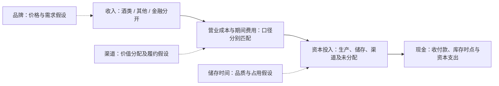

# 本人实际审核章节快照

审核对象：8d3e80f0b3ff03d43c876a800b123dc4c374e5c4版本的outputs/lec03-integrated-analysis.md第3、4节。此文件保持该版本章节原文，当时“待核”等措辞为历史状态。本轮审核通过不伪造对新增五年计算的本人点击确认。

## 3. 最重要的优势主张：品牌定价权五步链条

### 3.1 优势来源

**主张（Interpretation）**：茅台的品牌认知及消费场景中的认可，可能使购买者愿意为其支付溢价。研究者采用“暂时有效”的判断，并未声称已排除所有替代解释。

**已核证据（Fact）**：M01-D01证实公司把品牌列为五大核心竞争力之一（2024第8页）。这支持品牌是管理层明确提出的优势来源。品牌受认可的程度、消费者忠诚和支付意愿没有独立测量，仍Unknown。品质、工艺、环境、文化可能与品牌共同作用，不能仅因它们并列就把其贡献全计入品牌。

### 3.2 影响机制

**候选传导（Interpretation）**：消费者认可 → 提高可比产品的支付意愿、降低价格敏感性 → 在净售价提高时保持真实需求 → 企业取得价格收益 → 在扣除销售与履约成本后保留较高利润。渠道可能影响企业与经销商之间的价值分配，储存及工艺可能支撑品质与供给约束；三条路径要分别验证。

M01-D02证明公司将收入增长解释为销量增加和主要产品价格调整。它与候选机制方向相容，但没有提供提价前后的同款、同渠道需求试验。公司向渠道销售增加也可能来自备货，不能据此认定消费者价格弹性低。产品升级、渠道组合、短期供给约束和品质差异是合理替代解释。

### 3.3 可观察结果

| 变量：方向、时点、口径 | 已核结果 | 对机制的意义及限制 |
| --- | --- | --- |
| 2023—2024茅台酒产品组销售均价，收入÷同组销量 | 2023约300.62、2024约314.41万元/销售吨；K01与A01 | 产品组均价上升是正向线索；组内规格、酒龄与渠道组合未固定，不直接计为品牌净溢价 |
| 同期茅台酒公司销量 | 2024同比+10.22%；K01，2024第15页 | 均价与公司销量同向，支持暂定解释；不等于终端动销或市场份额增加 |
| 同期茅台酒毛利率 | 2023约94.12%、2024为94.06%；K01/G01 | 较高毛利仍保持，提供利润空间线索；未扣全部期间费用、税费和资本成本，无同行分位 |
| 2024系列酒和酒类加权毛利率 | 79.87%、92.01%；G02/G03 | 展示产品组差异与酒类总体盈利背景；系列酒不是无品牌对照，不能用二者差值量化纯品牌价值 |
| 两期单位销售成本与基酒产量 | 茅台酒单位销售成本+5.55%，基酒产量−1.63%；K01 | 不支持本期“扩产使单位成本下降”的简单路径；不能据此撤销另一条品牌价格机制 |
| 两期渠道组合均价和收入占比 | 直销均价430.02→410.73万元/销售吨；直销酒类收入占比45.67%→43.87%；A04-P/A04/C01/S02/S01 | 对“直销扩张持续抬高均价”的简单解释构成约束；组合均价下降不是固定产品降价，不能机械反证品牌 |

后续更强检验：固定SKU、规格、地区、渠道，观察提价前后实际净价、终端售出量及匹配竞品价差；观察3—5年同口径利润率、促销与资本回报。方向为净溢价维持、需求韧性和扣费用后的收益保持，数据尚缺则不作已发生的Forecast。

### 3.4 模仿壁垒

| 可能壁垒（Interpretation） | 为什么可能难复制 | 现有证据及缺口（Unknown） | 会绕过壁垒的情况 |
| --- | --- | --- | --- |
| 品牌心智与消费场景认可 | 认知与习惯可能需要长期积累，广告预算不能立刻复制 | 只有品牌核心竞争力自述；缺少消费者偏好、复购及替代试验 | 偏好迁移、竞品以其他价值取代原场景；知名度保持但支付意愿下降 |
| 品质、工艺与储存时间的配套 | 如需多年基酒与勾兑能力，新进入者必须经历时间并承担资金占用 | 2024第15页“五年”及跨年份勾兑为已定位但未独立确认的披露候选U02；未量化独有性、竞品工艺或资本门槛 | 已有陈年储备者、合作/采购或不同工艺达到消费者接受的替代品质 |
| 客户触达和渠道关系 | 稳定关系与服务可能帮助价格传导、价值获取 | 已核渠道统计，缺合同排他性、客户留存、获客履约费和渠道净利润 | 共用渠道、经销商议价增强、运营成本抵销价值获取 |

品牌、工艺和时间的相互配合是候选解释；长期储存同时可能是资本负担，不能把“慢”自动写成独有壁垒。渠道也不自动构成网络效应或高转换成本。

### 3.5 反证条件与处理

| 触发信号 | 必须控制的口径 | 怎样影响暂定判断 |
| --- | --- | --- |
| 可比净价溢价持续收窄，或提价后终端售出量相对对照持续下降 | 同SKU/规格、渠道、地区；扣折扣与退货，使用多个时点 | 直接削弱支付意愿与需求韧性；收窄或撤回品牌定价权解释 |
| 收入增长伴随渠道库存积压、促销或营销履约投入持续增加 | 分清公司与经销商库存、正常陈酿与可售品滞销；同期间费用口径 | 重检是否为真实需求，以及价格收益是否被维护成本抵销 |
| 同档替代品维持同等消费者认可且可更低成本、更短时间复制 | 匹配品质/消费场景及实际净价；不能只比较生产吨数 | 削弱壁垒与持续性，当前定价表现未必立即消失 |
| 毛利仍高但扣费用、存货和资本成本后回报下降 | 同业务、平均资本与期间利润匹配；留Lec04—05检验 | 收窄“持续高利润/经济回报”主张，不能只由毛利判定 |

上述是待验证的失效规则，不意味着这些负面事件已发生；也不设置没有依据的数值阈值。单位销售成本上升影响成本路径证据，单独不足以推翻品牌路径。**完整链条已经提出，证据链尚有缺环；研究者维持的是可反证的暂定Interpretation。**

## 4. B01：分开收入、成本、资本占用与现金转换

### 4.1 收入和营业成本：先分业务，再分产品与渠道

下表金额均为2024年度合并口径人民币元，直接复用已确认披露/统计，不新计算毛利或占比。

| 业务/产品 | 收入 | 营业成本 | 证据编号及范围 |
| --- | --- | --- | --- |
| 酒类主营业务 | 170,611,838,052.02 | 13,629,995,812.89 | C06、K01；成本为两产品组之和，第108及9页 |
| 其中：茅台酒 | 145,928,075,955.31 | 8,662,079,388.78 | N2024-01，第108页 |
| 其中：其他系列酒 | 24,683,762,096.71 | 4,967,916,424.11 | N2024-02，第108页；属于酒类，不能和“其他业务”混同 |
| 其他业务 | 287,314,224.32 | 159,486,555.09 | C07、N2024-03，第108页；主要酒店与冰淇淋，未拆各自分项 |
| 营业收入/营业成本合计 | 170,899,152,276.34 | 13,789,482,367.98 | C01、N2024-08；不含金融业务利息收入 |
| 金融业务利息收入 | 3,244,917,681.91 | 对应利息支出及金融成本未在本轮确认 | C04，第63页；独立列示，不塞入酒类或酒店收入 |
| 营业总收入 | 174,144,069,958.25 | 不能以“营业总成本”直接替代上列营业成本 | C03，第63页；C08财务费用中的利息收入不重复加入 |

产品与渠道是同一批收入的不同切面，不能把产品收入和渠道收入相加。酒类渠道采用第9/16页范围；第108页渠道包含其他业务，不能替代酒类渠道。本轮渠道均价和收入占比已核，渠道营业成本及费用净额尚未核验，不以直销均价高推导净利润更高。第16与9页直销收入69.21元差异继续保留，不擅自当舍入差处理。

### 4.2 资本占用：能归属才分配，不能按收入比例硬拆

| 对象 | 分开方法（Agent提出，Interpretation） | 已有证据与缺口 |
| --- | --- | --- |
| 酒类厂房、在建工程和生产存货 | 优先依据项目/资产用途直接归属；按期初期末平均经营资本匹配年度收益；分清基酒、半成品、包装成品 | K03确认特定存货科目原数，不证明全部均为酒类；项目归属、分产品资本及非销售变动Unknown |
| 品牌及渠道投入 | 当期推广、服务、履约支出先与相关产品/渠道匹配；共用资产按有证据的交易量、服务量等分配 | 不能把公司未确认的品牌价值或全部费用随意资本化；分摊依据与渠道资本Unknown |
| 储存资本 | 区分工艺必需陈酿与可售品积压；仓储/资金占用需匹配存量、酒龄与期限 | 至少五年及勾兑披露候选U02待核；期末账面存货不等于全部投入资本 |
| 其他业务及金融业务 | 酒店/冰淇淋经营资产与财务公司金融资产、资金负债分别识别 | 目前缺单独业务的资本与现金报表；不能因收入小就忽略金融资产与资金流 |
| 共享资本 | 披露不足时列“未分配”，说明可能影响，不生成貌似精确的业务ROIC | 收入占比可作另行敏感性方案，不能当实际资源占用或已确认Fact |

酒类、其他、金融与未分配四栏是后续资本底稿的结构，不是宣称年报已有对应四分部报告。本课只提出归属原则与证据要求；ROIC、资本周转及详细会计调整留Lec04—05。

### 4.3 利润为什么不等于现金

酒类先投入原料、人工及资本，存货可能多年后才出售；投入现金时点与营业成本结转时点不同。销售确认时点与客户实际付款时点也可能不同。若存在预收，收款可能早于收入；应付采购款可能延后现金支出。这些是待匹配的机制路径，不等于已经证明公司的具体收款条款。

公司经营现金流还可能含财务公司资金活动；不能把合并经营现金流变化全当酒类销售收现。净利润不等于毛利，CFO不等于FCF，资本支出也不能直接混入当期营业成本。现金利润转换若计算，应匹配集团净利润与集团现金，或完整剥离金融/其他后匹配酒类利润和现金，不能随意拿集团CFO除归母净利润解释酒类效率。

### 4.4 品牌、渠道、储存三条经济路径

| 路径与状态 | 收入→成本→资本→现金的机制 | 现有观察 | 后续变量、替代解释与反证 |
| --- | --- | --- | --- |
| 品牌（Interpretation） | 支付意愿可能支持净价/需求；维护品牌需推广与服务；库存和生产资本仍需投入；最终收现与资本回报另检验 | D01/D02，A01/G01，K01 | 同款净价、终端量、营销费率、平均资本；品质/供给/组合可替代品牌解释；溢价收窄或维护费吞噬收益使路径弱化 |
| 渠道（Interpretation） | 直销/批发改变价值分配及客户触达；自营需获客履约成本和相关资产；回款/退货/经销库存影响现金 | 已核直销与批发组合均价、占比，第16页；公司渠道定义候选U01待核 | 同商品渠道贡献利润、回款条款、退货和库存；组合差异可解释均价；净收益无优势或渠道压力上升为反证 |
| 储存时间（Interpretation） | 工艺及陈酿可能支持品质和供给差异；当前投入积累存货，销售时再结转成本；增长需先承担资本和现金占用 | K01基酒产量、销售量及K03存货原数；五年叙事候选U02 | 按酒龄/产品匹配生产—可售—库存—销售；正常陈酿不能视为滞销；需求下降造成可售品积压、时间门槛可绕过或回报不足为反证 |

图为经济联系索引，不是会计勾稽或已确认因果。虚线是三条待检验路径；主箭头依合同展现研究顺序，各环节不是简单减法恒等式。[三路径图](../docs/images/lec03-three-paths.svg)可独立查看。
