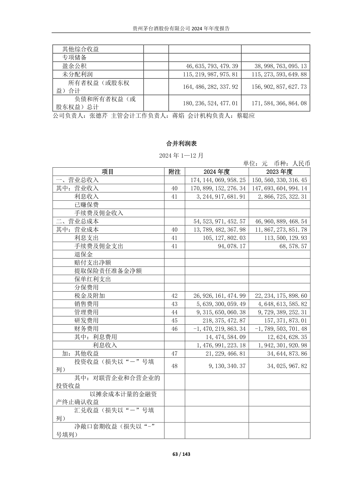
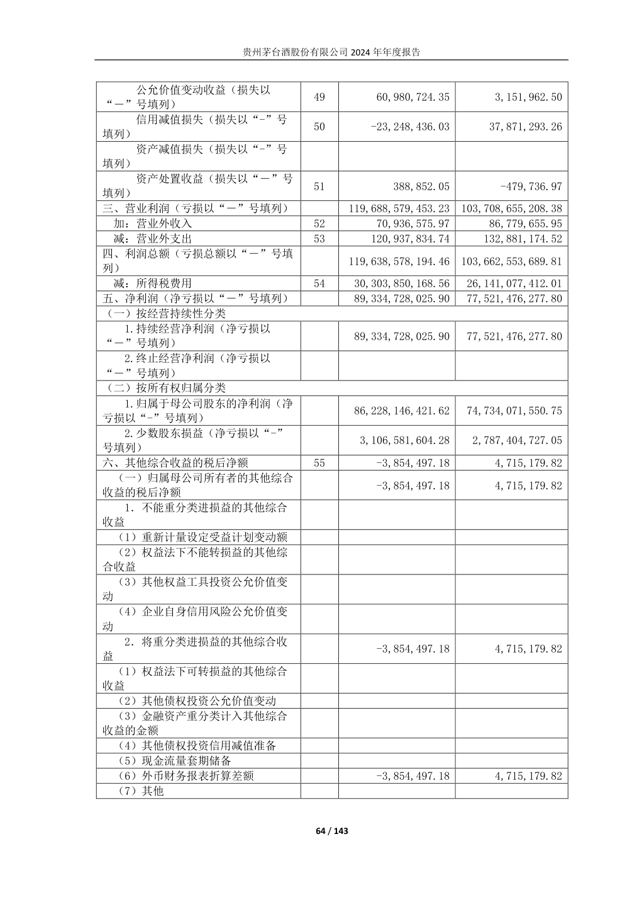

# 第一次任务：收入与归母净利润定位

> Agent定位、PDF原值对照和结构检查已完成。人工核验状态由统一核验记录更新；未确认条目保留Unknown，合同签署按实际情况另行完成。

材料：[600519_2024_贵州茅台_贵州茅台2024年年度报告_2025-04-03.pdf](../sources/annual_reports/pdf/600519_2024_贵州茅台_贵州茅台2024年年度报告_2025-04-03.pdf)。2024年1—12月、人民币元、企业会计准则、集团合并主体。第一次定位直接使用PDF，不以MD为输入。

| 编号 | 原表指标 | 2024年度数值（元） | PDF页／报告页 | 表与口径 | 交叉位置 | 核验／状态 |
| --- | --- | --- | --- | --- | --- | --- |
| C01 | 其中：营业收入 | 170,899,152,276.34 | 63／63 | 合并利润表；不含利息收入 | 5、8、108页 | 本人核验／Fact（Leo，2026-10-02T20:16:45+08:00） <!-- review-store:status:C01 --> |
| C02 | 归属于母公司股东的净利润 | 86,228,146,421.62 | 64／64 | 合并利润表；不含少数股东损益 | 5页归属于上市公司股东的净利润 | 本人核验／Fact（Leo，2026-10-02T20:16:47+08:00） <!-- review-store:status:C02 --> |

归属于上市公司股东与合并表的归属于母公司股东的归属范围由表名和分配分类确认，不以数值相近为选取理由。营业总收入174,144,069,958.25元是另一指标。

支持边界：仅指定年度披露定位与会计范围，不解释变化，不评价投资价值。核验状态见统一核验记录；口径取舍与合同签署按实际情况完成。

<!-- review-store:progress:start -->
当前有效Fact为6条；Unknown为57条；已撤回0条；需重新核验0条。共63条候选。 日期自动按Asia/Shanghai记录。合同验收、复核人与正式签署另行完成。

| 编号 | 有效状态 | 核验人 | 核验时间 | 备注／失效原因 |
| --- | --- | --- | --- | --- |
| C01 | Fact | Leo | 2026-10-02T20:16:45+08:00 |  |
| C02 | Fact | Leo | 2026-10-02T20:16:47+08:00 |  |
<!-- review-store:progress:end -->
