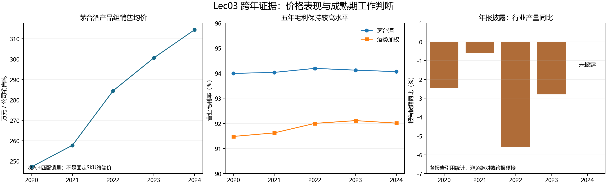
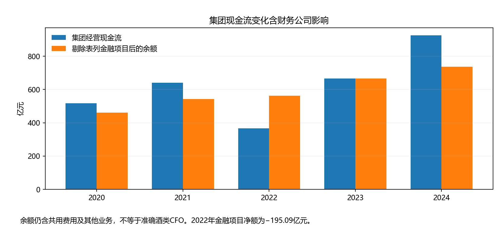

# Lec03最终研究结果与验收依据

**任务内容已完成并按本轮授权验收。** 本人已审核通过上一版第3节品牌逻辑、第4节数据及三路径资本现金解释；本轮由Agent核准2020—2024年报补证、计算与完善内容。本人暂定行业为成熟期，补证后的工作判断为“成熟期，以存量竞争、结构升级为主，叠加调整周期”。研究判断均为 **Interpretation**；执行人、复核人与签署按此前约定留空。

## 1. 三个问题的直接回答

| 维度 | 结论 | 对实际研究的含义 |
| --- | --- | --- |
| 品牌定价权M01 | 暂时认定有效，五年证据加强该解释；持续性与纯品牌因果尚未完全识别 | 保留品牌作为主要优势主张。成本路径证据不足不自动否定品牌路径；后续用同款净价、终端量及净收益反证 |
| 商业模式B01 | 收入、营业成本能区分酒类、其他业务及金融业务；资本能列直接归属项目，现金能剥出表列金融影响 | 已完成三路径分析及现金桥接。没有完整分部报表的资本/费用/现金列为未分配，不按收入占比虚造酒类ROIC或CFO |
| 行业竞争I01 | 广义白酒采用成熟期工作判断，并存在结构升级与调整周期；茅台内部量价与毛利表现具有韧性 | 研究重点转向溢价维护、竞争替代、库存与资本效率。未取得竞品/细分分母，不把公司增长写成市占率提升或高端酱香生命周期Fact |

信息截止教师指定2024年报版本；使用2020—2024五份原报的当期数据，不混入后来经营结果。本人本轮扩大材料与操作边界，现金分解作为明确授权的补充分析，原教师条款仍保留在[任务合同](../tasks/05-lec03-business-model.md)。本报告不形成估值或证券买卖Decision。

## 2. 品牌：五步链条及持续表现

| 环节 | 本轮结论与证据 | 替代解释、反方证据与支持边界 |
| --- | --- | --- |
| 优势来源 | Interpretation：品牌认知与消费场景认可；Fact：公司明确把品牌列为核心竞争力（D01） | 品质、工艺、环境和文化共同作用；消费者忠诚及支付意愿尚未直接测量 |
| 影响机制 | Interpretation：品牌认可→支付意愿/较低价格敏感性→价格及真实需求→公司保留收益 | 品质、稀缺供给、规格升级、渠道组合可解释表现；公司销售量不是终端售出量 |
| 可观察结果 | Fact：2020—2024茅台酒产品组均价与公司销量均增加，毛利率持续约94%；年度结果见下表 | 产品组统计没有固定SKU；毛利未扣全部期间费用、税费及资本成本，不单独识别品牌因果 |
| 模仿壁垒 | Interpretation：长期品牌心智，品质/储存/勾兑的配套；Fact：连续五份年报披露五年储存及跨年份勾兑安排 | 时间与资本门槛具有合理性；工艺独有性、竞品储备和绕过路径Unknown，不能断言不可复制 |
| 反证条件 | Interpretation：同款净溢价持续收窄、提价后终端量相对下降、维护费用/库存资本吞噬收益或替代品被同等接受时重评 | 检验同规格、渠道、地区与时点，区分正常陈酿和可售品积压；不声称风险已经发生 |

| 年度 | 茅台酒收入（亿元） | 公司销量（吨） | 均价（万元/销售吨） | 茅台酒毛利率 | 系列酒毛利率 | 酒类加权毛利率 |
| --- | --- | --- | --- | --- | --- | --- |
| 2020 | 848.31 | 34312.53 | 247.23 | 93.99% | 70.14% | 91.48% |
| 2021 | 934.65 | 36261.31 | 257.75 | 94.03% | 73.69% | 91.62% |
| 2022 | 1078.34 | 37901.39 | 284.51 | 94.19% | 77.22% | 92.00% |
| 2023 | 1265.89 | 42109.50 | 300.62 | 94.12% | 79.76% | 92.11% |
| 2024 | 1459.28 | 46412.95 | 314.41 | 94.06% | 79.87% | 92.01% |

均价=匹配产品组销售收入÷公司销量÷10,000；毛利率=(收入−对应营业成本)÷收入。原币种人民币元，均价展示万元/销售吨；计算用原值，展示统一四舍五入到两位。2020—2024茅台酒收入累计增长72.02%、销量增长35.27%、产品组均价增长27.17%。这是公司产品组名义表现，未控制规格/酒龄/渠道，不解释为纯提价或纯品牌价值。

茅台酒毛利率五年稳定于约94%，系列酒毛利率上升，酒类加权毛利率亦保持较高水平。这比单一年份更支持“价格收益和利润空间得以维持”的解释，但仍不是全费用后利润、资本回报或消费者忠诚的直接测量。

已有2023—2024成本核验表仍有效：茅台酒单位销售成本上升、基酒产量下降，不能支持简单规模经济路径；生产成本桥接依赖五项假设，真值仍Unknown。参见[成本报告](m01-scale-and-production-cost.md)。不把营业成本/生产吨当作同年实际生产单位成本，也不把品牌优势绑定为必须同时有成本下降。

## 3. 商业模式：业务分开，三路径落到资本与现金

### 3.1 收入与营业成本的业务边界

2024年合并收入、对应营业成本（亿元）如下；精确元值在本人已认可的[整合分析第4节](lec03-integrated-analysis.md#4-b01分开收入成本资本占用与现金转换)：

| 对象 | 收入 | 营业成本 | 处理 |
| --- | --- | --- | --- |
| 酒类 | 1,706.12 | 136.30 | 分为茅台酒与其他系列酒；其他系列酒仍属于酒类 |
| 其他业务 | 2.87 | 1.59 | 酒店与冰淇淋等业务，未硬拆各自费用/资本/现金 |
| 商品及服务营业收入合计 | 1,708.99 | 137.89 | C01范围，不加入财务费用抵减的利息收入 |
| 金融业务利息收入 | 32.45 | 金融支出单列，未作为上述营业成本 | C04组成项；不是酒类收入，不可独立代表全集团收入 |
| 营业总收入 | 1,741.44 | 不与营业成本作无差别对应 | C03范围，保留不同收入定义 |

产品与渠道是同一酒类收入的不同切面，不能相加。渠道金额采用酒类表，避免混入第108页全营业收入的其他业务。2024第16页万元显示值与第9页直销精确元值相差69.21元，两版原值均保留；本轮跨年渠道均价采用“渠道精确元值÷本期渠道销量”，不覆盖此前已人工认可的万元表计算。

### 3.2 渠道：价值获取增强，但净利润仍要扣费用

| 年度 | 直销酒类收入占比 | 直销毛利率 | 批发代理毛利率 | 直销均价（万元/销售吨） | 批发代理均价（同单位） |
| --- | --- | --- | --- | --- | --- |
| 2020 | 13.96% | 95.62% | 90.80% | 336.73 | 135.69 |
| 2021 | 22.66% | 96.12% | 90.30% | 418.94 | 135.13 |
| 2022 | 39.89% | 96.20% | 89.22% | 441.41 | 130.54 |
| 2023 | 45.67% | 95.46% | 89.29% | 430.02 | 138.77 |
| 2024 | 43.87% | 95.33% | 89.42% | 410.73 | 147.09 |

Fact：直销酒类收入占比由2020年的13.96%上升至2023年的45.67%，2024回落为43.87%；2024直销毛利率95.33%，高于批发代理89.42%。Interpretation：企业可借直销提高对消费者的触达和对渠道利润的获取。对照是2024直销占比、组均价及毛利率均回落，不能认定直销扩张永远提高收益。

两渠道组没有控制相同产品组合；直销还承担推广、履约和服务投入，因此毛利差并非同款渠道净贡献差。回款条款、退货和经销商库存未单独披露，本轮不填写虚构的回款天数或“先款后货”Fact。

### 3.3 资本：能直接识别项目，尚不能精确拆出分部存量

Fact：2024第14页列示3万吨系列酒配套项目、习水同民坝一期及茅台酒十四五建设项目，当期投入分别为12.195468、8.332528、5.614354亿元，合计26.14235亿元。这些项目可直接归属酒类，证明增长同时需要先期资本投入；它们是所列项目当期投资额，**不是全部酒类资本支出、资产存量或集团现金表资本支出**。

Fact：五份年报连续披露茅台酒至少五年的工艺储存安排，并说明跨年份/轮次/浓度基酒勾兑。储存造成生产投入与销售结转的时间差，也使新进入者需要时间和资金储备；独有壁垒仍需竞品对照。实物库存如下，不能以吨直接转为账面资本，也不能以全部存货认定全部酒类投入资本。

| 年度 | 成品酒（吨） | 半成品酒含基础酒（吨） | PDF页 |
| --- | --- | --- | --- |
| 2020 | 8314.11 | 240921.41 | 12 |
| 2021 | 10282.35 | 250463.82 | 13 |
| 2022 | 12495.28 | 264127.89 | 14 |
| 2023 | 13985.07 | 279804.96 | 15 |
| 2024 | 17760.00 | 292248.02 | 14 |

Interpretation：半成品储备与工艺时滞相容，成品酒增加值得跟踪，但正常陈酿不等于滞销，增加亦不能直接认定渠道积压。酒店、冰淇淋、金融及共享资本继续列“未分配”，详细分部ROIC/周转待有成本和资本归属数据后再算。

### 3.4 现金：集团表现与酒类表现须分开

下表金额为亿元；现金转换分母使用**合并全部净利润（含少数股东）**匹配集团CFO。C09在此可作集团现金转换分母，但仍不能替代C02归母净利润用于股东盈利分析。各年用当年原报当前列，2022原报与2023重述比较数不暗中混接。

| 年度 | 集团CFO | 表列金融项目净额 | 剔除表列金融项目后的余额 | 购建长期资产现金 | CFO减该支出 | CFO/集团净利润 |
| --- | --- | --- | --- | --- | --- | --- |
| 2020 | 516.69 | 54.85 | 461.84 | 20.90 | 495.79 | 104.33% |
| 2021 | 640.29 | 98.50 | 541.79 | 34.09 | 606.20 | 114.91% |
| 2022 | 366.99 | -195.09 | 562.08 | 53.07 | 313.92 | 56.14% |
| 2023 | 665.93 | 0.48 | 665.46 | 26.20 | 639.73 | 85.90% |
| 2024 | 924.64 | 188.09 | 736.55 | 46.79 | 877.85 | 103.50% |

表列金融项目净额=客户存款和同业存放净增加额+收取利息/手续费/佣金现金−客户贷款及垫款净增加额−存放央行和同业净增加额−拆出资金净增加额−支付利息/手续费/佣金现金。剔除余额=集团CFO−上述净额，且另以销售收款、退税、其他经营收款减采购、职工、税费及其他经营付款交叉算得，两条路径精确勾稽。

**剔除余额仍包含其他业务及共用费用、金融业务分摊薪酬税费等，不是准确酒类CFO。** CFO减购建长期资产现金只是简化现金代理，不是完整FCFF/FCFE，亦不代表可全部分配的现金。

2022集团CFO仅366.99亿元，表列金融项目净流出195.09亿元，剔除后的余额562.08亿元；2023前述金融项目净额接近零，2024净流入188.09亿元。Interpretation：2022低现金转换不能直接归因于酒类品牌失效，2024强CFO也不能全归因于品牌收现。公司2022第8页、2023第9页、2024第9页分别解释吸收存款减少/同业存款增加、不可提前支取存款净增加减少、成员单位资金归集增加，独立现金分解与该叙事相容；公司原因解释仍不是完整因果证明。

三条路径的最终判断：**品牌**有价格和较高毛利线索，但维护费与实际净收益另检；**渠道**提供触达和价值分配能力，但组合与履约投入必须控制；**储存**支持品质和供给时滞，同时带来库存、资本及现金占用，不以时间长自动证明护城河。三路径互相配合，没有把同一收益重复归因。

## 4. 行业：按五步给出成熟期及竞争位置结果

### 定边界

行业阶段先回答年报有证据的“全国规模以上白酒”广义范围；茅台酒/高端酱香属于公司研究工作边界，不能把广义统计当细分市场数据。公司销量单位吨，行业产量万千升，且一个是销售、一个是生产，不能直接相除为份额。公司、经销商及终端用户也须分别识别。

### 分阶段

**Interpretation：采用成熟期（存量竞争、结构升级），叠加调整周期。** 本人作出暂定成熟期判断，Agent以五年报告补证。下面是每份报告各自引用的原披露，不是已桥接一致的时间序列：

| 年度 | 产量（万千升） | 收入（亿元） | 利润总额（亿元） | 原报产量同比 | 原报收入同比 | 原报利润同比 | PDF页 |
| --- | --- | --- | --- | --- | --- | --- | --- |
| 2020 | 740.73 | 5836.39 | 1585.41 | -2.46% | 4.61% | 13.35% | 12 |
| 2021 | 715.63 | 6033.48 | 1701.94 | -0.59% | 18.6% | 32.95% | 13 |
| 2022 | 671.24 | 6626.45 | 2201.72 | -5.58% | 9.64% | 29.36% | 14 |
| 2023 | 449.2 | 7563 | 2328 | -2.8% | 9.7% | 7.5% | 14 |
| 2024 | 414.5 | 7963.84 | 2508.65 | 未披露 | 未披露 | 未披露 | 14 |

证据路径：2020—2023四份报告披露产量同比均为负，和规模快速扩张的简单成长期解释不相容；同期收入及利润同比为正，与“总量承压但价值升级/头部集中”的解释相容。2020第16页描述市场向头部集中，2021第16—17页描述产销趋稳、向优势品牌/企业/产区集中，2022第18页强调马太效应，2023第19页明确2016年以来进入存量竞争，2024第20页提出宏观与产业调整双周期。这些跨年表述与数量信息一起，较强支持广义成熟期工作判断。

反方与边界：收入利润增长说明成熟并不等于全面衰退；高端酱香可能有不同细分阶段；宏观调整可能是周期因素。上述是同一家公司年报引用国家统计局/酒业协会并作出的叙事，五年重复披露不是五个独立研究来源。缺少终端消费、同口径企业数/集中度和进入退出资料，生命周期没有升级为Fact。

### 找核心

成熟期核心问题转为：公司能否以品牌支持支付意愿，以渠道获取价格收益，并承担多年储存和先期扩产占用，从行业价值分配中保持收益？茅台酒五年公司量价及毛利表现比“行业是否总量扩张”更直接；行业收入利润增长也可以来自价格、结构和头部集中，不证明全体企业同样受益。

### 验逻辑

公司2020—2024茅台酒销量与产品组均价均增加，毛利持续约94%，因此采用“在成熟行业背景下具有品牌相关的内部竞争韧性”Interpretation。2024直销占比下降、单位销售成本上升、资本及存货增加是约束条件；未有竞品净价、终端量和匹配分母，不能认定份额增长、成本第一、纯品牌溢价或细分阶段已经证实。

### 防风险

优先观察同款净溢价/终端量、正常陈酿与可售品库存、扣履约费用后的渠道收益和酒类资本回报。偏好/收入下降→支付意愿弱化→公司/渠道库存承压→费用增加或现金/资本回报下滑是一条可反证的机制安排。出现信号时缩小或撤回品牌解释，重新评估细分阶段，不把条件预警当已发生Forecast。

## 5. 核准方式、缺证及合同验收

本人真实审核第3节逻辑和第4节数据/路径的原话、所指提交及章节文本摘要绑定见[本轮内容审核](../evidence/lec03-content-review.json)与[被审核章节快照](../evidence/lec03-approved-sections.md)。本人审核Unknown的记录仅覆盖上一版明确列出的缺证，不伪造额外人工核验。

新增16组年度资料核准由Agent执行，身份为“本人明确授权Agent”，不是16次本人点击；它们与旧39条人工分域记录有部分内容重叠，不报告为55个独立证据。使用新事实须调用ReviewStore.lec03_agent_facts()重新核PDF、代码、真实授权、输入及结果；旧五接口与原47 Unknown/17窗口事件保持权威和历史。阶段判断、因果与壁垒仍用Interpretation/Unknown。

| 保留Unknown | 已解决的部分 | 下一验证 |
| --- | --- | --- |
| 品牌净溢价的独立因果、终端忠诚、壁垒独有性 | 公司品牌自述与五年量价毛利已经核准，链条及反证完整 | 同SKU/渠道/地区实际净价与终端量、竞品/消费者对照 |
| 酒类准确生产成本、分部平均资本/ROIC/现金净额 | 既有成本统计、项目用途、储存披露及表列金融现金桥接完成 | 成本滚动与酒龄/存货价值，费用资本现金直接归属；延续Lec04—05 |
| 高端酱香阶段、可比市占率和同行相对溢价 | 广义白酒成熟期判断已有跨年支持 | 匹配细分市场的连续终端与竞品分母，不硬接广义绝对数 |

本课五项成果均完成；前10项内容条件核准完成，最后签署条件待本人统一填写。[逐项验收](../docs/lec03-acceptance.md)记录每项依据与责任。[阶段成果](lec03-stage-deliverables.md)、[矩阵](lec03-evidence-matrix.md)及[过程底稿](../work/lec03-claim-notes.md)已同步。无需再次核准已经认可的第3、4节及旧数字；以后材料或公式变更时才重新检查有效性。未收到Lec04—05独立任务合同，不虚构后续合同或投资Decision。

## 附录A：可复核来源与计算

| 年度原件 | 行业/叙事页 | 产品金额/销量页 | 渠道金额/销量页 | 集团净利润页 | 现金读取页 | 来源SHA-256 |
| --- | --- | --- | --- | --- | --- | --- |
| [2020年报](../sources/annual_reports/pdf/600519_2020_贵州茅台_贵州茅台2020年年度报告_2021-03-30.pdf) | 12 / 16 | 8 / 13 | 14 / 13 | 54 | 56,57,58,59 | 464e4c179a18ebea566c5ddc5a4dbcfb83824227e9a10eb1ba0baa23c9d58d2c |
| [2021年报](../sources/annual_reports/pdf/600519_2021_贵州茅台_贵州茅台2021年年度报告_2022-03-30.pdf) | 13 / 16,17 | 8 / 14 | 15 / 15 | 55 | 57,58,59,60 | f65effdde58bcea99fd6bdb53f61b31d5c432e6dfb2661e5caf05156a433ea5a |
| [2022年报](../sources/annual_reports/pdf/600519_2022_贵州茅台_贵州茅台2022年年度报告_2023-03-30.pdf) | 14 / 18 | 9 / 14,15 | 16 / 15 | 59 | 61,62,63,64 | de394171306b9f2c7d79f54990de2a9e9c99feb54413150180179e24f0d83358 |
| [2023年报](../sources/annual_reports/pdf/600519_2023_贵州茅台_贵州茅台2023年年度报告_2024-04-03.pdf) | 14 / 19 | 9 / 15 | 17 / 16 | 64 | 66,67,68,69 | 2125ff97a452ea79b0d784e2432f7d224b6aecc330b644b593477d69e22f4ed1 |
| [2024年报](../sources/annual_reports/pdf/600519_2024_贵州茅台_贵州茅台2024年年度报告_2025-04-03.pdf) | 14 / 20 | 9 / 15 | 9 / 16 | 64 | 66,67,68,69 | 5299f4940e2ce4e91084b73dc457d558b9d335fa76fbfee6227e4254eb7f4a30 |

输入[lec03-agent-inputs.json](../work/lec03-agent-inputs.json)、结果[lec03-agent-results.json](../work/lec03-agent-results.json)、核准缓存[lec03-agent-facts.json](../evidence/lec03-agent-facts.json)、重核代码[lec03_agent_analysis.py](../scripts/lec03_agent_analysis.py)。计算按Decimal原值执行；原表空白为该项算术0，保留blank标记，未将上年数挪入当年。2022拆出资金本期空白、上期−4亿元；2024退税本期空白、上期1,500,047.04元，均已按列位置对照原PDF核准。

独立核验方法为pypdf与PyMuPDF双引擎原文一致性、现金空间列定位、产品/渠道合计及现金两路径算术校验，再查看原页图像。保留原件，原报引用不因计算冲突被替改。[五年行业原页摘图](../docs/images/lec03-industry-source-crops.png)可直接查看，原PDF仍为来源。

## 附录B：行业口径冲突保留

| 年度 | 变量 | 跨原报绝对值简单重算同比 | 该年度报告披露同比 | 采用原则 |
| --- | --- | --- | --- | --- |
| 2021 | 行业产量 | -3.39% | -0.59% | 保留原披露；采用报告披露同比，禁止硬接统一序列 |
| 2021 | 行业收入 | 3.38% | 18.6% | 保留原披露；采用报告披露同比，禁止硬接统一序列 |
| 2021 | 行业利润 | 7.35% | 32.95% | 保留原披露；采用报告披露同比，禁止硬接统一序列 |
| 2022 | 行业产量 | -6.20% | -5.58% | 保留原披露；采用报告披露同比，禁止硬接统一序列 |
| 2022 | 行业收入 | 9.83% | 9.64% | 保留原披露；采用报告披露同比，禁止硬接统一序列 |
| 2023 | 行业产量 | -33.08% | -2.8% | 保留原披露；采用报告披露同比，禁止硬接统一序列 |
| 2023 | 行业收入 | 14.13% | 9.7% | 保留原披露；采用报告披露同比，禁止硬接统一序列 |
| 2023 | 行业利润 | 5.74% | 7.5% | 保留原披露；采用报告披露同比，禁止硬接统一序列 |

例如2023产量449.2÷2022产量671.24−1约为−33.08%，但2023原报披露−2.8%。样本/基数桥接未披露，本轮不认定报告错，也不填补外部数。图中使用每份报告披露同比，2024没有同比就标未披露；不把这些绝对数硬拼成行业CAGR、连续量降幅或市占率。

## 附录C：工作流程与存放原因

1. 保存本人原话及上一版章节快照，区分本人审核与本轮Agent授权核准。
2. 从五年原报告指定页面提取数据，双引擎核对，现金按空间列解决空白与上期数错位。
3. 用原值计算产品/渠道单位经济、集团现金转换和金融现金桥接，保留统计冲突及Unknown。
4. 完成三维结论、证据矩阵、五项成果与10项内容验收，保护原核验账本、源文件及签署空栏。
5. 自动检查后提交中文Git记录并推送，更新会话交接入口；下次先读CURRENT，按需读取本报告及当前事实接口。

outputs/存研究成果，work/存可复算输入结果与底稿，evidence/存真实答复和核准绑定，docs/存验收及图片，scripts/存重核代码，../会话交接/存精简当前摘要。准备日志与备份只放会话交接/tmp、课件与任务文件/acceptance-prep等被Git忽略目录，不作为新会话必读上下文。
