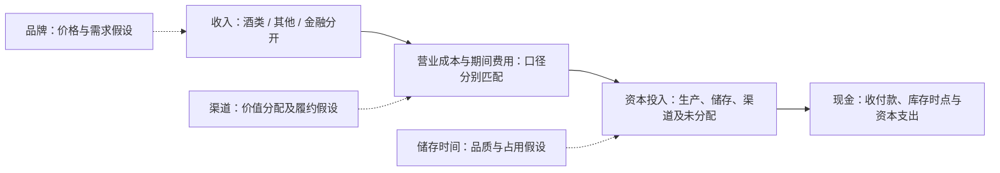

# Lec03三维研究：商业模式、行业竞争与品牌定价权

当前裁决：研究者在核验两期成本结果后，明确维持“茅台暂时具有品牌定价权”的判断，状态为 **Interpretation**。研究重点是品牌形成价格与需求优势的路径；成本优势为另一项检验，不作为品牌定价权成立的必要前提。三维问题已确定，本报告为Agent整理的可审阅底稿，尚未经过本人对本轮新增逻辑的验收。

## 1. 本轮选题与责任

| 维度 | 本轮研究问题 | 选题责任与状态 |
| --- | --- | --- |
| 竞争优势M01 | 品牌是否在同口径下形成定价权？最重要的优势能否沿五步链条展开？ | 本人选定并明确维持暂定判断；Interpretation |
| 商业模式B01 | 如何分开酒类及其他收入、成本、资本占用与现金转换？重点核查品牌、渠道和储存时间三条路径。 | 本人本轮明确采用；分析关系为Interpretation，缺证保留Unknown |
| 行业竞争I01 | 以茅台酒为重点，在高端酱香白酒的候选市场边界下，现有年报的产品、渠道及供给时间证据能支持怎样的竞争位置判断？哪些需求、替代和进入风险会使判断失效？ | 本人授权Agent定义，Agent据现有资源选定；不是本人已核验结论 |

依据指定2020—2024年报与Lec03主课件第三—五节、Append2；本轮主要复用2023—2024已确认记录。新增叙事仅定位2024年报，未引入外部行业或竞品资料、期后结果。行业问题的交付是明确市场边界、完成五步证据分析并裁决可知与未知；不以缺失的市场分母虚构行业排名。

## 2. 证据怎么使用

2024原件：[指定年报](../sources/annual_reports/pdf/600519_2024_贵州茅台_贵州茅台2024年年度报告_2025-04-03.pdf)，发布日期2025-04-03，SHA-256 `5299f4940e2ce4e91084b73dc457d558b9d335fa76fbfee6227e4254eb7f4a30`。2023原件：[指定年报](../sources/annual_reports/pdf/600519_2023_贵州茅台_贵州茅台2023年年度报告_2024-04-03.pdf)，发布日期2024-04-03，SHA-256 `2125ff97a452ea79b0d784e2432f7d224b6aecc330b644b593477d69e22f4ed1`。下文页码为PDF和报告页码，二者一致。研究信息截止指定2024年报版本；没有用后来实际经营结果验证当时预测。

| 可复用证据 | 当前权威与定位 | 支持边界 |
| --- | --- | --- |
| 原披露16项，包括C01/C03/C04/C06/C07、N2024-01/02/03/08 | ReviewStore.facts()；2024合并利润表63—64页、收入成本附注108页；证据账本保留逐项版本 | 原报值与已裁决口径；母公司、少数股东、财务费用利息项目不代替集团营业口径 |
| CH01/CH02 | change_facts()；两期原值、可比性及公式的独立绑定 | 营业收入及归母净利润同比，只作背景 |
| M01-D01—D03 | m01_disclosure_facts()；2024年报8页 | 公司确实这样表述，不代表其原因解释已被证明 |
| M01-A/G/C/S共15项 | m01_metric_facts()；2024年报9、15、16、108页；详见[均价毛利表](m01-average-price-and-margin.md) | 公司产品组/渠道组均价、毛利及比较；不是固定SKU终端价或消费者销量 |
| M01-K01/K02/K03 | m01_scale_facts()；2023与2024年报9、10、14、15页、分别80/79页存货及94/93页政策；详见[成本表](m01-scale-and-production-cost.md) | K01成本统计、K02营业成本构成；K03只确认存货原数和附条件算术，生产成本真值与假设仍Unknown |

本轮使用前重新调用上述接口，仍为16/2/3/15/3，共39条分域记录。本轮没有新增Fact。下文新增经营模式、储存时间和行业叙事候选标为Unknown；Agent原文定位不代替人工确认。快照[研究更新记录](../evidence/lec03-research-update.json)用于审计本轮引用，不替代当前接口。

## 3. 最重要的优势主张：品牌定价权五步链条

### 3.1 优势来源

**主张（Interpretation）**：茅台的品牌认知及消费场景中的认可，可能使购买者愿意为其支付溢价。研究者采用“暂时有效”的判断，并未声称已排除所有替代解释。

**已核证据（Fact）**：M01-D01证实公司把品牌列为五大核心竞争力之一（2024第8页）。这支持品牌是管理层明确提出的优势来源。品牌受认可的程度、消费者忠诚和支付意愿没有独立测量，仍Unknown。品质、工艺、环境、文化可能与品牌共同作用，不能仅因它们并列就把其贡献全计入品牌。

### 3.2 影响机制

**候选传导（Interpretation）**：消费者认可 → 提高可比产品的支付意愿、降低价格敏感性 → 在净售价提高时保持真实需求 → 企业取得价格收益 → 在扣除销售与履约成本后保留较高利润。渠道可能影响企业与经销商之间的价值分配，储存及工艺可能支撑品质与供给约束；三条路径要分别验证。

M01-D02证明公司将收入增长解释为销量增加和主要产品价格调整。它与候选机制方向相容，但没有提供提价前后的同款、同渠道需求试验。公司向渠道销售增加也可能来自备货，不能据此认定消费者价格弹性低。产品升级、渠道组合、短期供给约束和品质差异是合理替代解释。

### 3.3 可观察结果

| 变量：方向、时点、口径 | 已核结果 | 对机制的意义及限制 |
| --- | --- | --- |
| 2023—2024茅台酒产品组销售均价，收入÷同组销量 | 2023约300.62、2024约314.41万元/销售吨；K01与A01 | 产品组均价上升是正向线索；组内规格、酒龄与渠道组合未固定，不直接计为品牌净溢价 |
| 同期茅台酒公司销量 | 2024同比+10.22%；K01，2024第15页 | 均价与公司销量同向，支持暂定解释；不等于终端动销或市场份额增加 |
| 同期茅台酒毛利率 | 2023约94.12%、2024为94.06%；K01/G01 | 较高毛利仍保持，提供利润空间线索；未扣全部期间费用、税费和资本成本，无同行分位 |
| 2024系列酒和酒类加权毛利率 | 79.87%、92.01%；G02/G03 | 展示产品组差异与酒类总体盈利背景；系列酒不是无品牌对照，不能用二者差值量化纯品牌价值 |
| 两期单位销售成本与基酒产量 | 茅台酒单位销售成本+5.55%，基酒产量−1.63%；K01 | 不支持本期“扩产使单位成本下降”的简单路径；不能据此撤销另一条品牌价格机制 |
| 两期渠道组合均价和收入占比 | 直销均价430.02→410.73万元/销售吨；直销酒类收入占比45.67%→43.87%；A04-P/A04/C01/S02/S01 | 对“直销扩张持续抬高均价”的简单解释构成约束；组合均价下降不是固定产品降价，不能机械反证品牌 |

后续更强检验：固定SKU、规格、地区、渠道，观察提价前后实际净价、终端售出量及匹配竞品价差；观察3—5年同口径利润率、促销与资本回报。方向为净溢价维持、需求韧性和扣费用后的收益保持，数据尚缺则不作已发生的Forecast。

### 3.4 模仿壁垒

| 可能壁垒（Interpretation） | 为什么可能难复制 | 现有证据及缺口（Unknown） | 会绕过壁垒的情况 |
| --- | --- | --- | --- |
| 品牌心智与消费场景认可 | 认知与习惯可能需要长期积累，广告预算不能立刻复制 | 只有品牌核心竞争力自述；缺少消费者偏好、复购及替代试验 | 偏好迁移、竞品以其他价值取代原场景；知名度保持但支付意愿下降 |
| 品质、工艺与储存时间的配套 | 如需多年基酒与勾兑能力，新进入者必须经历时间并承担资金占用 | 2024第15页“五年”及跨年份勾兑为已定位但未独立确认的披露候选U02；未量化独有性、竞品工艺或资本门槛 | 已有陈年储备者、合作/采购或不同工艺达到消费者接受的替代品质 |
| 客户触达和渠道关系 | 稳定关系与服务可能帮助价格传导、价值获取 | 已核渠道统计，缺合同排他性、客户留存、获客履约费和渠道净利润 | 共用渠道、经销商议价增强、运营成本抵销价值获取 |

品牌、工艺和时间的相互配合是候选解释；长期储存同时可能是资本负担，不能把“慢”自动写成独有壁垒。渠道也不自动构成网络效应或高转换成本。

### 3.5 反证条件与处理

| 触发信号 | 必须控制的口径 | 怎样影响暂定判断 |
| --- | --- | --- |
| 可比净价溢价持续收窄，或提价后终端售出量相对对照持续下降 | 同SKU/规格、渠道、地区；扣折扣与退货，使用多个时点 | 直接削弱支付意愿与需求韧性；收窄或撤回品牌定价权解释 |
| 收入增长伴随渠道库存积压、促销或营销履约投入持续增加 | 分清公司与经销商库存、正常陈酿与可售品滞销；同期间费用口径 | 重检是否为真实需求，以及价格收益是否被维护成本抵销 |
| 同档替代品维持同等消费者认可且可更低成本、更短时间复制 | 匹配品质/消费场景及实际净价；不能只比较生产吨数 | 削弱壁垒与持续性，当前定价表现未必立即消失 |
| 毛利仍高但扣费用、存货和资本成本后回报下降 | 同业务、平均资本与期间利润匹配；留Lec04—05检验 | 收窄“持续高利润/经济回报”主张，不能只由毛利判定 |

上述是待验证的失效规则，不意味着这些负面事件已发生；也不设置没有依据的数值阈值。单位销售成本上升影响成本路径证据，单独不足以推翻品牌路径。**完整链条已经提出，证据链尚有缺环；研究者维持的是可反证的暂定Interpretation。**

## 4. B01：分开收入、成本、资本占用与现金转换

### 4.1 收入和营业成本：先分业务，再分产品与渠道

下表金额均为2024年度合并口径人民币元，直接复用已确认披露/统计，不新计算毛利或占比。

| 业务/产品 | 收入 | 营业成本 | 证据编号及范围 |
| --- | --- | --- | --- |
| 酒类主营业务 | 170,611,838,052.02 | 13,629,995,812.89 | C06、K01；成本为两产品组之和，第108及9页 |
| 其中：茅台酒 | 145,928,075,955.31 | 8,662,079,388.78 | N2024-01，第108页 |
| 其中：其他系列酒 | 24,683,762,096.71 | 4,967,916,424.11 | N2024-02，第108页；属于酒类，不能和“其他业务”混同 |
| 其他业务 | 287,314,224.32 | 159,486,555.09 | C07、N2024-03，第108页；主要酒店与冰淇淋，未拆各自分项 |
| 营业收入/营业成本合计 | 170,899,152,276.34 | 13,789,482,367.98 | C01、N2024-08；不含金融业务利息收入 |
| 金融业务利息收入 | 3,244,917,681.91 | 对应利息支出及金融成本未在本轮确认 | C04，第63页；独立列示，不塞入酒类或酒店收入 |
| 营业总收入 | 174,144,069,958.25 | 不能以“营业总成本”直接替代上列营业成本 | C03，第63页；C08财务费用中的利息收入不重复加入 |

产品与渠道是同一批收入的不同切面，不能把产品收入和渠道收入相加。酒类渠道采用第9/16页范围；第108页渠道包含其他业务，不能替代酒类渠道。本轮渠道均价和收入占比已核，渠道营业成本及费用净额尚未核验，不以直销均价高推导净利润更高。第16与9页直销收入69.21元差异继续保留，不擅自当舍入差处理。

### 4.2 资本占用：能归属才分配，不能按收入比例硬拆

| 对象 | 分开方法（Agent提出，Interpretation） | 已有证据与缺口 |
| --- | --- | --- |
| 酒类厂房、在建工程和生产存货 | 优先依据项目/资产用途直接归属；按期初期末平均经营资本匹配年度收益；分清基酒、半成品、包装成品 | K03确认特定存货科目原数，不证明全部均为酒类；项目归属、分产品资本及非销售变动Unknown |
| 品牌及渠道投入 | 当期推广、服务、履约支出先与相关产品/渠道匹配；共用资产按有证据的交易量、服务量等分配 | 不能把公司未确认的品牌价值或全部费用随意资本化；分摊依据与渠道资本Unknown |
| 储存资本 | 区分工艺必需陈酿与可售品积压；仓储/资金占用需匹配存量、酒龄与期限 | 至少五年及勾兑披露候选U02待核；期末账面存货不等于全部投入资本 |
| 其他业务及金融业务 | 酒店/冰淇淋经营资产与财务公司金融资产、资金负债分别识别 | 目前缺单独业务的资本与现金报表；不能因收入小就忽略金融资产与资金流 |
| 共享资本 | 披露不足时列“未分配”，说明可能影响，不生成貌似精确的业务ROIC | 收入占比可作另行敏感性方案，不能当实际资源占用或已确认Fact |

酒类、其他、金融与未分配四栏是后续资本底稿的结构，不是宣称年报已有对应四分部报告。本课只提出归属原则与证据要求；ROIC、资本周转及详细会计调整留Lec04—05。

### 4.3 利润为什么不等于现金

酒类先投入原料、人工及资本，存货可能多年后才出售；投入现金时点与营业成本结转时点不同。销售确认时点与客户实际付款时点也可能不同。若存在预收，收款可能早于收入；应付采购款可能延后现金支出。这些是待匹配的机制路径，不等于已经证明公司的具体收款条款。

公司经营现金流还可能含财务公司资金活动；不能把合并经营现金流变化全当酒类销售收现。净利润不等于毛利，CFO不等于FCF，资本支出也不能直接混入当期营业成本。现金利润转换若计算，应匹配集团净利润与集团现金，或完整剥离金融/其他后匹配酒类利润和现金，不能随意拿集团CFO除归母净利润解释酒类效率。

### 4.4 品牌、渠道、储存三条经济路径

| 路径与状态 | 收入→成本→资本→现金的机制 | 现有观察 | 后续变量、替代解释与反证 |
| --- | --- | --- | --- |
| 品牌（Interpretation） | 支付意愿可能支持净价/需求；维护品牌需推广与服务；库存和生产资本仍需投入；最终收现与资本回报另检验 | D01/D02，A01/G01，K01 | 同款净价、终端量、营销费率、平均资本；品质/供给/组合可替代品牌解释；溢价收窄或维护费吞噬收益使路径弱化 |
| 渠道（Interpretation） | 直销/批发改变价值分配及客户触达；自营需获客履约成本和相关资产；回款/退货/经销库存影响现金 | 已核直销与批发组合均价、占比，第16页；公司渠道定义候选U01待核 | 同商品渠道贡献利润、回款条款、退货和库存；组合差异可解释均价；净收益无优势或渠道压力上升为反证 |
| 储存时间（Interpretation） | 工艺及陈酿可能支持品质和供给差异；当前投入积累存货，销售时再结转成本；增长需先承担资本和现金占用 | K01基酒产量、销售量及K03存货原数；五年叙事候选U02 | 按酒龄/产品匹配生产—可售—库存—销售；正常陈酿不能视为滞销；需求下降造成可售品积压、时间门槛可绕过或回报不足为反证 |

图为经济联系索引，不是会计勾稽或已确认因果。虚线是三条待检验路径；主箭头依合同展现研究顺序，各环节不是简单减法恒等式。[三路径图](../docs/images/lec03-three-paths.svg)可独立查看。

## 5. I01：按五步完成现有资源内的竞争位置研究

### 第一步：定边界

研究主对象为茅台酒；“中国市场中的高端酱香白酒及满足相近消费场景的替代品”是工作边界（Interpretation），价格带、规格、客户和地区仍需匹配，未宣称构成已验证经济学相关市场。其他系列酒另列，不把其产品组等同高端茅台酒市场；酒店/冰淇淋及金融业务不进入白酒份额分子。

产业链工作图：粮食、包装及能源 → 制曲/制酒/储存/勾兑/包装 → 公司直销及批发代理 → 终端购买者。2024第7—8、15页已定位披露候选U01；品牌、渠道、储存分别影响需求、价值分配和供给时间。公司终端消费者、经销商与财务公司客户必须分开。第14页引用全国规模以上白酒统计，吨与千升也不同；它缺少本研究细分市场分母，不能用于高端酱香市占率。

### 第二步：分阶段

**行业阶段Unknown。** 公司2024收入、销量增长和高毛利不能证明细分行业处于成长期或成熟期。现有单家公司年报没有匹配细分范围的连续3—5年终端需求、竞争者进入退出、集中度或渗透率；第20页管理层对调整周期及未来需求的叙事U03，不能替代这些数据，也不把预测当后来已发生的Fact。

保持条件分析：若细分需求仍增长，重点检验增长能否覆盖资本与费用；若趋成熟，重点检验溢价、利润分配和替代；若持续收缩，重点检验库存、现金与产能退出。三个分支是研究安排，均不是已经裁定的行业阶段或Forecast。

### 第三步：找核心

本轮核心问题（Interpretation）为：**消费者对品牌的支付意愿能否经渠道变成公司利润，同时承担长期供给与库存占用？** 已核高毛利和产品组量价是内部竞争位置线索；渠道均价差提示利润可能在生产者、经销商与零售端间分配，但公司没有核验经销商利润池。上游材料人工价格、替代品牌/消费场景、渠道议价和长期资本负担是约束。没有同业数据，不宣称公司成本第一、份额第一或行业利润池份额。

### 第四步：验逻辑

| 可回答的检验 | 已核依据 | 本轮裁决与替代解释 |
| --- | --- | --- |
| 本公司茅台酒两期组合均价和销量是否同向？ | A01/K01；2023—2024 | 是，支持暂定价格/需求解释；组合、供给及渠道备货尚未排除；不证明同行份额 |
| 高毛利是否与成本下降同步？ | G01/K01/K02 | 单位销售成本上升、高毛利保持；品牌价格路径可以单独提出，未取得同业成本优势证据 |
| 直销比例和均价是否持续提高？ | S01/S02、A04/C01 | 两期直销收入占比及组合均价均下降；不支持简单直销扩张叙事，也不证明直销净收益下降 |
| 当期基酒产量能否解释同年出厂销量？ | K01产销量；第15页时滞候选U02 | 分母性质不同，不直接计算当期产销率验证短缺；多年存储、留存与勾兑待核，库存滚动需后续验证 |
| 能否判定行业阶段、市占率和相对溢价？ | 没有匹配行业分母、可比竞品净价或终端量 | Unknown；完成证据适用性裁决，不强行补数字 |

### 第五步：防风险

优先跟踪三个变量：①匹配产品的净价溢价与终端售出量；②分清正常陈酿和可售品积压的公司/渠道库存；③扣履约费用后的渠道收益、回款与资本占用。观察连续年度及提价事件前后，不预设现有年报能提供高频先行数据。

风险传导（Interpretation）：消费偏好或收入变化 → 支付意愿/售出量下降 → 溢价与库存承压；渠道折扣/议价增强 → 企业价值获取减少；竞品或工艺替代 → 模仿时间门槛被绕过；生产与仓储扩张快于需求 → 资本占用及回报压力。各项均为反证方向，未声称已发生或触发具体监管事件。

**I01完成的结论**：现有年报能支持对本公司产品组量价、毛利和渠道结构的内部比较，足以组织一项待证的品牌竞争位置解释；无法完成相对同行优势、细分市场份额、生命周期和壁垒独有性的事实裁决。研究者M01暂定判断保留，行业命题充分成立仍Unknown。

## 6. 两项人工核验记录与剩余工作

| 记录 | 实际过程 | 当前状态与责任 |
| --- | --- | --- |
| H01：可以使用的事实 | 本人先前核对公司品牌自述、产品收入成本、均价/毛利与新增成本结果；本轮重检当前绑定有效 | 原编号Fact复用，不伪造新确认或签署；公司自述与机制解释分开 |
| H02：证据不足的机制 | 本轮本人明确成本结果不改变品牌定价权的暂定判断；Agent记录同款净价、忠诚度、竞品、市场分母及资本现金的缺证 | 本人判断为Interpretation；因果充分成立、可持续性及模仿壁垒仍Unknown。本人尚未就本轮完整缺证表另作验收，不将“授权展开”冒充Unknown核验 |

本轮没有证券买卖Decision。三维问题和五项底稿成果已展开；[证据矩阵](lec03-evidence-matrix.md)、[五项成果索引](lec03-stage-deliverables.md)、[合同](../tasks/05-lec03-business-model.md)同步。新增原文候选U01—U03与现有Fact严格分开：U01经营流程/渠道定义（第7—8、15页）、U02储存/勾兑说明（第15页）、U03行业范围/未来叙事（第14、20页）。它们只作定位线索，未加入原窗口或39条有效记录。

下一步只审阅本轮逻辑及Unknown边界，已有数字无需重复核。可直接聊天说明需要修改的链条，或明确认可逻辑及缺证保留；若要把U01—U03具体原文升为Fact，另回原文逐项核验。详见[下一步](../docs/next-review.md)。姓名、复核和签署按本人安排最后填写，Lec03尚未正式验收；Lec04—05没有独立合同资料，不虚构其成果。
