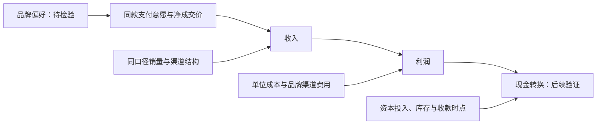

# Lec03：五项阶段成果准备包

> 本人已选择M01竞争优势研究问题；M01背景复用既有有效Fact。三项公司叙事及新增计算已由本人核对；品牌机制待继续验证，选题不证明机制；其他问题保留为未选候选。姓名与签署留空。

## 1. 业务与行业问题清单

| 来源 | 本组拟研究问题 |
| --- | --- |
| 商业模式 | 如何分开酒类及其他收入、成本、资本占用与现金转换？重点核查品牌、渠道和储存时间三条路径。 |
| 行业竞争-定边界 | 上游粮食/包装，制曲制酒储存勾兑包装，下游自营/数字平台及经销商；高端酱香与广义白酒边界如何匹配？ |
| 行业竞争-分阶段 | 细分市场处于成熟还是增长/收缩阶段？需要多期需求与终端动销，当前Unknown。 |
| 行业竞争-找核心 | 利润在生产者、渠道、消费者及供应商之间如何分配？价格与库存会否改变分配？ |
| 行业竞争-验逻辑 | 相同范围的量、价、份额、渠道贡献利润与资本回报能否验证叙事？ |
| 行业竞争-防风险 | 哪些终端价、库存、回款、替代信号会使品牌或渠道命题失效？ |
| 竞争优势 | 品牌/工艺/环境与渠道如何通过价格或成本影响回报？同业为何难复制？ |

## 2. 叙事—变量—证据矩阵

[六条矩阵](lec03-evidence-matrix.md)保留。M01本人已选，背景复用已有Fact；其他问题待本人取舍，机制未证明。

## 3. 商业模式经济逻辑图

收入：量×价×产品与渠道组合；不从酒类收入/吨推定单品价格。成本：粮食包装、人工、制造与物流，费用另列。资本：厂房产能、基酒和成品存货、数字渠道投入。现金：收款和营运资本时点，以及财务公司资金流；利润不等于现金，经营现金流也不等于自由现金流。箭头表示候选联系，不是已证明因果。

## 4. 竞争优势证据要求表

| 优势来源 | 影响机制假设 | 可观察结果 | 模仿壁垒待证 | 反证条件 | 当前状态 |
| --- | --- | --- | --- | --- | --- |
| 品牌／消费者偏好 | 价格溢价而不牺牲同口径销量 | 产品/渠道可比的价差、量与份额 | 消费者支付意愿与长期品牌积累 | 提价后动销下降、溢价收窄 | Interpretation |
| 工艺／环境／时间 | 稳定品质或供给约束影响价格成本 | 同工艺质量、单位成本、库存与可售供给 | 地域条件及多年储存能否复制 | 竞品复制品质与单位经济 | Interpretation |
| 渠道／客户触达 | 降低获客成本或提高价值获取 | 渠道贡献利润、复购和现金回款 | 网络关系是否稀缺排他 | 成本增速抵销毛利、经销关系受损 | Interpretation |

## 5. M01本人记录：既有Fact复用与待核Unknown

| 核验记录 | 拟核验主张／位置 | 当前状态 | 本人应做什么 | 签认后如何处理 |
| --- | --- | --- | --- | --- |
| H01背景 | C01合并营业收入及N2024-01/N2024-02产品收入成本；既有原文定位保留 | 既有Fact复用，使用前校验绑定 | 原核验已保存，无需重复点击 | 保留原编号和历史，不新增Fact；不能据此确认品牌机制 |
| H02缺证 | “品牌形成可持续定价权”；PDF8页自述、9页产品组表 | 公司自述已核；机制Unknown，本人边界裁决待补 | 核原文并说明同款成交价、动销及匹配竞品证据是否足够 | 保存本人实际裁决；缺证保留Unknown，不把选题视为核验 |

执行人：__________；复核人：__________；签署日期：__________。

本课没有完整Lec04—05材料，不替代其财务分析、三表勾稽、ROIC或估值任务。列出明确后续问题，等待相应材料。

<!-- scope-acceptance:m01-package:start -->
## M01选题与配套问题

仅M01已由本人选定。上方通用问题保留为Agent准备，尚不等于本组最终选题。

| 维度 | 围绕M01的配套问题建议 | 选择状态 |
| --- | --- | --- |
| 商业模式 | 可比产品和渠道的价格、销量如何影响收入与成本？品牌/渠道投入、库存占用如何影响利润和现金转换？ | Agent建议，待本人选择 |
| 行业竞争 | 在相同档次、规格、地区、渠道和时间的竞争系统中，净价差、销量位置及替代风险如何变化？行业阶段与利润池证据是否足够？ | Agent建议，待本人选择 |
| 竞争优势 | 品牌是否在同口径下形成定价权？ | M01本人已选 |

### 经济逻辑展开（全部箭头为待检验联系）

现有集团收入与利润增长、产品组收入成本只能作为背景；图中品牌、净价、动销、资本与现金之间的因果联系尚未证明。单位经济、资本回报与现金细分留Lec04—05。[完整M01底稿](../work/lec03-m01.md)。
<!-- scope-acceptance:m01-package:end -->

<!-- scope-acceptance:m01-analysis:start -->
## 本轮M01补充成果

三条公司自述Fact单独登记；产品组、酒类及渠道均价和产品收入加权毛利率已计算，结果已本人核验通过。四项判断标准已展开为证据、缺证和反证，机制及持续性仍待验证。[M01底稿](../work/lec03-m01.md)；[计算表](m01-average-price-and-margin.md)。
<!-- scope-acceptance:m01-analysis:end -->
