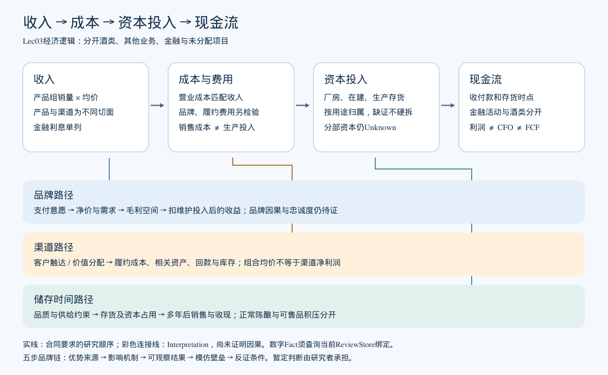

# Lec03五项阶段成果（内容验收完成）

本人已审核上一版第3、4节并暂定行业成熟期；Agent按本轮明确授权完成补证、完善与内容核准。10项内容条件已完成，签署仍留空。当前研究入口为[最终结果](lec03-final-results.md)。

## 1. 业务与行业问题清单

| 维度 | 最终问题 | 确定方式 |
| --- | --- | --- |
| B01商业模式 | 如何分开酒类及其他收入、成本、资本占用与现金转换？重点核查品牌、渠道和储存三路径。 | 本人选题，数据及路径解释已核准 |
| I01行业竞争 | 现有年报能支持何种行业阶段及公司竞争位置？按定边界、分阶段、找核心、验逻辑、防风险展开。 | 本人授权Agent定义，本人暂定成熟期，Agent补证 |
| M01竞争优势 | 品牌是否形成定价权？最重要优势按五步链条展开。 | 本人选题并维持暂定有效，逻辑已核准 |

## 2. 叙事—变量—证据矩阵

[当前矩阵](lec03-evidence-matrix.md)区分披露Fact、机制Interpretation及缺证Unknown。每项明确变量/方向/时点/口径、原文定位、替代解释、反方和后续，所有新数字可按[最终报告附录A](lec03-final-results.md)复核。

## 3. 商业模式经济逻辑图

收入→成本→资本投入→现金流是研究顺序，虚线是机制假设。酒类/其他/金融边界、项目直接归属、五年库存和集团金融现金桥接见[最终报告第3节](lec03-final-results.md)。原图保留；不把毛利等同净利润，不把剔除金融后的余额等同准确酒类CFO。

## 4. 竞争优势证据要求表

| 环节 | 本轮结论与证据 | 替代解释、反方证据与支持边界 |
| --- | --- | --- |
| 优势来源 | Interpretation：品牌认知与消费场景认可；Fact：公司明确把品牌列为核心竞争力（D01） | 品质、工艺、环境和文化共同作用；消费者忠诚及支付意愿尚未直接测量 |
| 影响机制 | Interpretation：品牌认可→支付意愿/较低价格敏感性→价格及真实需求→公司保留收益 | 品质、稀缺供给、规格升级、渠道组合可解释表现；公司销售量不是终端售出量 |
| 可观察结果 | Fact：2020—2024茅台酒产品组均价与公司销量均增加，毛利率持续约94%；年度结果见下表 | 产品组统计没有固定SKU；毛利未扣全部期间费用、税费及资本成本，不单独识别品牌因果 |
| 模仿壁垒 | Interpretation：长期品牌心智，品质/储存/勾兑的配套；Fact：连续五份年报披露五年储存及跨年份勾兑安排 | 时间与资本门槛具有合理性；工艺独有性、竞品储备和绕过路径Unknown，不能断言不可复制 |
| 反证条件 | Interpretation：同款净溢价持续收窄、提价后终端量相对下降、维护费用/库存资本吞噬收益或替代品被同等接受时重评 | 检验同规格、渠道、地区与时点，区分正常陈酿和可售品积压；不声称风险已经发生 |

五年产品组均价、销量及毛利见[最终结果第2节](lec03-final-results.md)，本人已通过原品牌链条逻辑。新增五年数字为Agent核准，不伪造本人点击。成本路径与品牌路径分开，生产成本桥接假设仍Unknown。

## 5. 两项真实人工核验记录

| 编号 | 内容与实际行为 | 状态与出处 |
| --- | --- | --- |
| H01 | 本人先前核对公司将品牌列为核心竞争力的原文，及产品/均价毛利、成本计算；当前旧接口重新校验有效。此次又认可第4节数据与路径 | Fact：D01等旧记录；来源2024第8页及原各账本。本人本次答复不扩写为对新五年数据逐项点击 |
| H02 | 本人此次认可上一版第3节逻辑，其中明确保留品牌因果/持续性、消费者忠诚、壁垒独有性等缺证；完整原章节与答复绑定保存 | Unknown：品牌独立因果/忠诚/独有壁垒，当前解释为Interpretation。认可逻辑不把缺证变为Fact |

真实答复、审核提交/章节SHA及Agent补证授权见[内容审核记录](../evidence/lec03-content-review.json)、[被审核章节快照](../evidence/lec03-approved-sections.md)。广义成熟期为本人暂定+Agent年报支持的Interpretation；细分阶段与市占率仍Unknown。

执行人：__________；复核人：__________；签署日期：__________。

[逐项验收](../docs/lec03-acceptance.md)：五项成果和10项内容条件完成；签署最后由本人统一填写。后续细分竞争、成本滚动与分部资本现金验证已安排，未提供Lec04—05独立合同则不编造其交付。
