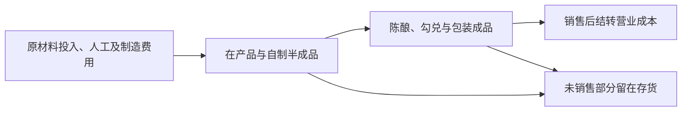

# M01两期单位成本、生产成本与规模经济补充分析

更新：2026-10-03。本人要求补算2023年并将生产成本纳入考虑。本轮新增输入和计算结果尚待本人核验，保留Unknown；已有36条分域Fact与原确认历史保持原样。

## 1. 两个成本口径分别处理

**单位销售成本＝同产品当期营业成本÷当期销量。** 用于比较已售出产品的成本，不以生产量替代销量。生产成本则关注当年投入并进入在产品、半成品及成品的成本；上述相关年报披露没有单列可直接匹配当期产量的生产总成本或分产品制造成本滚动表。

第14页的实际产能按实际基酒产量计算，第15页也说明茅台酒从生产到出厂至少需要五年，并涉及不同年份基酒勾兑。因而当年基酒产量、完工包装成品和当年销售量不是同一批次。2023年报第80页、2024年报第79页披露销售发出采用移动加权平均法。直接以营业成本÷当年基酒产量，会把销售结转与生产批次混配。

## 2. 2023—2024年单位销售成本

| 产品范围 | 2023单位销售成本（万元/吨） | 2024单位销售成本（万元/吨） | 变化 | 销量变化 | 基酒产量变化 |
| --- | --- | --- | --- | --- | --- |
| 茅台酒 | 17.68 | 18.66 | 5.55% | 10.22% | -1.63% |
| 其他系列酒 | 13.40 | 13.46 | 0.45% | 18.47% | 12.05% |
| 酒类整体 | 15.86 | 16.36 | 3.14% | 13.73% | 4.24% |

| 年度 | 茅台酒基酒产量（吨） | 系列酒基酒产量（吨） | 酒类销量（吨） | 酒类营业成本（亿元） | 酒类毛利率 |
| --- | --- | --- | --- | --- | --- |
| 2023 | 57,204.11 | 42,937.04 | 73,274.04 | 116.20 | 92.11% |
| 2024 | 56,271.99 | 48,112.51 | 83,332.76 | 136.30 | 92.01% |

例：2023茅台酒7,445,470,669.11元÷42,109.50吨＝176,812.14元/销售吨；2024年8,662,079,388.78元÷46,412.95吨＝186,630.66元/销售吨。同比用未舍入结果计算，得到5.55%，不能用表中两位小数万元金额反算精确同比。

茅台酒2023组合销售均价约300.62万元/吨、毛利率94.12%；2024分别约314.41万元/吨、94.06%。系列酒2023毛利率79.76%，酒类整体92.11%；可提供两期高毛利背景，但不代表长期持续性已证明。

本期酒类销量增加13.73%，营业成本增加17.30%，单位销售成本增加3.14%；其中茅台酒基酒产量反而下降1.63%，系列酒产量上升12.05%。不能把“销量扩大”直接改写为“茅台酒生产规模扩大”。

## 3. 生产相关成本构成

两份年报第10页可拆分材料、人工、制造费用、燃料动力及运输费，其合计与酒类营业成本一致。以下是**已结转营业成本中的生产相关构成**，不是本年新投入生产的材料、人工金额；制造费用不等于全部固定成本。

| 营业成本构成 | 2023金额（亿元） | 2024金额（亿元） | 2023元/销售吨 | 2024元/销售吨 | 每销售吨变化 |
| --- | --- | --- | --- | --- | --- |
| 直接材料 | 59.84 | 68.95 | 81,668.22 | 82,744.41 | 1.32% |
| 直接人工 | 43.72 | 52.24 | 59,666.61 | 62,693.81 | 5.07% |
| 制造费用 | 6.41 | 7.76 | 8,742.71 | 9,316.55 | 6.56% |
| 燃料动力 | 3.51 | 4.22 | 4,795.51 | 5,067.98 | 5.68% |
| 运输费 | 2.72 | 3.12 | 3,712.50 | 3,738.32 | 0.70% |

两大产品组拆分：总体每销售吨成本增加4975.53元，其中按2023销量权重固定的组内单位成本效应为+5898.53元，产品组销量占比变化效应为-923.00元。两项相加与整体增量一致。这仅控制两大产品组占比，尚未控制组内规格、渠道、酒龄、投入品价格或工艺变化。

## 4. 生产成本的存货桥接情景

为把生产成本纳入考虑，使用“在产品＋自制半成品＋库存商品”账面余额作情景桥接；原材料尚未投入，不直接纳入该余额。来源是2023年报第94页（含2022年末比较余额）与2024年报第93页。

**附条件当期生产投入≈酒类营业成本＋生产性存货期末余额－期初余额。** 更完整的滚动关系还需加回非销售减少、扣除外购成品与其他非生产增加，并核对合并范围、存货产品范围和计价。没有这些滚动项，不把算出的残差当作披露Fact。两期跌价准备余额相同，不等于其他调整全部为零。

| 存货桥接情景 | 2023 | 2024 | 说明 |
| --- | --- | --- | --- |
| 酒类营业成本（亿元） | 116.20 | 136.30 | 已售出商品结转成本 |
| 生产性存货期初余额（亿元） | 349.08 | 430.72 | 在产品＋自制半成品＋库存商品；不含未投料原材料 |
| 生产性存货期末余额（亿元） | 430.72 | 512.49 | 用账面余额，跌价准备单独核查 |
| 附条件生产投入估计（亿元） | 197.84 | 218.07 | 营业成本＋上述存货余额净增加；不是原报直接披露 |
| 估计投入÷当年基酒产量（万元/吨） | 19.76 | 20.89 | 不同加工阶段仍错配，只作敏感性观察，不能当作准确单位制造成本 |

该情景生产投入估计增加10.23%；估计投入÷基酒吨数增加5.75%。**这不是准确单位制造成本：集团存货不必然全属酒类，营业成本含运输等项目，投入可能用于基酒、储存及包装等不同加工阶段，产量分母则是基酒。** 表中比率只显示在给定简化假设下的敏感性，不能据此直接判定有或无规模经济。

| 桥接所需假设 | 当前状态 |
| --- | --- |
| 存货产品范围与酒类营业成本一致 | Unknown |
| 非原材料存货没有外购成品或其他非生产增加 | Unknown |
| 没有未调整的非销售减少、转出或盘盈盘亏 | Unknown |
| 合并范围与成本计价没有造成不可比变化 | Unknown |
| 生产投入与年度基酒吨数的加工阶段和产品构成可匹配 | Unknown |

## 5. 对本人暂定判断的影响

本人暂定判断是“茅台具有品牌定价权”，登记为**Interpretation（待补证）**。已核验高毛利与公司品牌自述为该判断提供研究线索；公司自述并不独立证明消费者忠诚，毛利也可能受成本、产品组合、供给和渠道影响。

本轮单位成本没有随销量扩大下降，削弱了“本期成本下降体现规模经济”的支持。但“规模增长同时单位成本上升”不是充分否定条件：投入品涨价、质量/产品组合、增产阶段费用与多年生产销售时滞均可能抵消规模节约。茅台酒基酒产量本期下降，更不能用该样本直接检验其扩产降本。

品牌定价权与规模经济是不同机制；成本优势不足可以降低竞争优势的综合支持强度，但不会逻辑上直接否定品牌带来的支付意愿。对可持续定价权仍需同款净成交价、提价后终端动销、消费者复购与匹配竞争参照。上述为Agent限定说明，未代写本人已经认可这些修正。

## 6. 数据与核验入口

来源定位：2023年报第9、10、14、15、80、94页；2024年报第9、10、14、15、79、93页。2023产品收入成本与新增产量、成本构成、存货输入尚待本人核验；2024已确认收入成本仅复用有效原编号，本次比较与情景结果不继承上轮15项结果的确认。

[原输入与来源绑定](../work/m01-scale-inputs.json)、[公式结果与假设](../work/m01-scale-results.json)、[计算脚本](../scripts/calculate_m01_scale.py)、[本人原答复与暂定判断](../evidence/m01-research-judgment.json)。只需按[下一步](../docs/next-review.md)核这批新增项目，不重复核已有效36项，不把情景假设一并签成真实生产成本。
