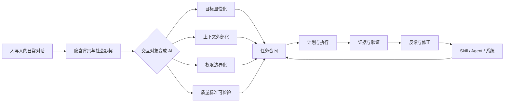

# AI时代投资研究的人机交互转型——从自然语言对话到可审计协作系统

> [!abstract] 课程定位
> 这不是一门“提示词技巧课”，而是一门**协作方式转型课**。主课件已经讲清公司、证券、估值、定价和投资判断之间的关系，本课不再重复。这里集中回答：当交互对象变成能够读取文件、检索资料、调用工具和执行长程任务的 AI Agent 时，投资研究者怎样把自然语言转化为目标、上下文、边界、验证和反馈组成的任务合同，并进一步把成功经验沉淀为可复用的研究流程？

> [!important] 核心命题
> ==与 Agent 共同做投资研究，不是把人与人之间的对话原样搬到屏幕上，而是把隐性的研究意图、信息背景、操作权限、判断标准和纠错过程显性化。==

[返回主课件：从公司信息到投资判断](Lec_从公司信息到投资判断_HTML/Lec_01_从公司信息到投资判断_AI时代的证券分析与人机协作_第二版_修订稿.md)

## 课程信息

| 项目 | 内容 |
|---|---|
| 课程主题 | AI 时代如何与 Agent 共同完成投资研究 |
| 适用对象 | 2026-2027 金融专硕学生 |
| 总时长 | 3 课时，每课时 45 分钟 |
| 教学方式 | 概念讲授、案例比较、Prompt 改写、角色练习、工作流设计 |
| 前置要求 | 已学习第 1 课主课件；使用过任意对话式大模型 |
| 与主课件关系 | 方法补充；不重复投资学概念、茅台年报事实和 Decision Card |
| 最终产出 | 一份投研任务合同与一套可复用的反馈—验证模板 |

## 学习目标

完成三课时后，学习者应当能够：

1. 解释为什么人与机器交互不能完全照搬人与人交互；
2. 把模糊愿望改写成包含目标、场景、上下文、边界和完成标准的任务合同；
3. 在复杂任务开始前组织需求对齐、计划审阅和分阶段执行；
4. 用可观察差距、证据和验证方法纠正 AI，而不是只说“这里不对”；
5. 区分 AI 适合执行的环节与必须由人承担判断责任的环节；
6. 把一次任务中的成功路径和失败经验固化为 Skill、项目规则或 Agent 工作流；
7. 设计独立审阅、多 Agent 辩论和可追溯的投资研究流程。

## 课程知识地图



> [!note] 使用说明
> 本课沿用主课件的贵州茅台案例，但不再讲解公司事实和投资判断本身。课堂关注的对象是：同一项研究任务应当怎样向 Agent 表达、怎样纠错、怎样验收。

---

# 第一课：从“像对人说话”到“与机器签订任务合同”

## 本课问题

> [!question]
> 为什么我们对研究助理说一句“把这家公司分析一下”，对方可能会结合课堂要求继续工作；但把同一句话交给 Agent，却很容易得到一份形式完整、实际上无法用于研究的报告？

## 45 分钟安排

| 时间 | 教学活动 | 目标 |
|---|---|---|
| 0—5 分钟 | 对比两个 Prompt | 发现“自然”不等于“有效” |
| 5—12 分钟 | 人际对话与机器交互的差异 | 建立转型必要性 |
| 12—25 分钟 | 任务合同五要素 | 掌握基本结构 |
| 25—35 分钟 | 公司研究案例拆解 | 从真实任务中识别表达技巧 |
| 35—42 分钟 | 小组改写练习 | 将模糊任务改成任务合同 |
| 42—45 分钟 | 总结与退出票 | 检查核心概念 |

## 一、为什么不能把机器当作普通同事

人与人交互时，许多信息不必说出口。共同经历、组织文化、身份关系、表情语气和常识会自动补全句子的含义。机器虽然能够生成自然语言，却不能稳定继承这些隐含条件。

| 人际交互中的默认条件 | 与 AI 交互时的风险 | 需要完成的转型 |
|---|---|---|
| 对方大致知道“我为什么要做” | AI 可能只执行表面动作 | 从动作指令转向目的说明 |
| 对方了解项目历史 | 新会话未必拥有历史上下文 | 从默认背景转向上下文外部化 |
| 对方知道哪些文件不能碰 | Agent 可能把可访问理解为可修改 | 从社会边界转向显式权限 |
| 对方能感知“差不多就行” | AI 不知道“好”的具体含义 | 从模糊期待转向验收标准 |
| 对方会为行动承担责任 | AI 不承担投资判断及其后果 | 从结果接受转向人类把关 |
| 对方可能主动澄清 | AI 也可能直接作出合理化假设 | 从等待默契转向要求反向提问 |

> [!warning] 一个常见误区
> AI 的语言越像人，我们越容易高估它与我们共享背景、标准和责任的程度。==语言自然性不等于任务理解的完整性。==

## 二、第一次转型：从“动作指令”转向“目的说明”

公司研究任务提供了一个典型对比。

### 低信息表达

> 帮我整理一下贵州茅台 2024 年年报。

### 目的驱动表达

> 请整理贵州茅台 2024 年年报。整理本身不是最终目的；我希望用这份材料训练学生从可定位的公司信息出发提出研究问题。因此，输出应服务于后续课堂讨论，而不是替学生给出投资结论。

这两句话要求的表面动作相似，但第二种表达告诉了 AI：

- 为什么需要整理；
- 产物未来由谁使用；
- 输出将支持什么研究活动；
- 哪类“完整答案”反而偏离目标。

> [!tip] 填空模板：目的驱动表达
> 请完成【动作】。这样做不是为了【表面产物】本身，而是为了【最终目的】。未来我希望在【使用场景】中，由【使用者】利用它完成【能力或决策】。

> [!example]- 示例：建立公司研究底稿
> 请整理这家公司近五年的年报和公告。整理本身不是最终目的；我希望研究者能够从每项关键主张回到原始材料，并区分当时可得信息与事后信息，为后续判断和复盘保留一致的信息集。

## 三、第二次转型：从“许愿”转向“场景化任务”

“帮我做一份公司分析”无法约束信息密度、专业程度、时间尺度和使用方式。

### 五个最小槽位

```text
任务 + 使用场景 + 受众 + 规模 + 内容来源
```

> [!tip] 填空模板：场景化任务
> 请制作【产物】，用于【场景】，受众是【对象】，预计【时长／篇幅】。内容基于【材料】，重点帮助受众理解或完成【目的】。

> [!example] 课程示例
> 请制作一份 15 分钟的课堂演示，用于金融专硕《投资学》第 1 课，受众是尚未系统学习公司估值的学生。内容只基于贵州茅台 2024 年年报，重点展示怎样把模糊请求改写成可核验的研究任务，不重复讲解年报数字，也不给出买卖建议。

场景信息会改变输出：课堂演示、公司研究底稿、投资委员会陈述和事后复盘，不应具有相同的信息密度、时间尺度和叙事结构。

## 四、第三次转型：从“默认背景”转向“上下文外部化”

机器需要知道的不只是任务，还包括当前世界的状态。

### 上下文的四层结构

1. **身份上下文**：我是谁、我的专业与表达偏好；
2. **项目上下文**：项目目标、目录、当前阶段与已有成果；
3. **知识上下文**：应优先阅读哪些年报、公告、数据、笔记和规范；
4. **操作上下文**：可用工具、环境差异、输出位置和执行约定。

投资研究还应说明信息冻结到什么时点、当前处于事实还是判断阶段，以及哪些结论已经由人确认，不能被 Agent 静默改写。

> [!tip] 填空模板：先探索，再行动
> 请先阅读和探索【文件／目录／项目】，识别【结构、已有实现、当前状态和约束】。在充分理解现状之前不要修改。随后先向我说明：你认为项目正在解决什么问题、目前进行到哪一步、还缺什么信息。

> [!example]- 示例：接手已有公司研究
> 当前目录已经有年报事实表和第一轮公司分析。请先检查目录、来源和现有结论，不要假设项目仍处于起点，也不要重新生成已经核验的事实。先区分已确认内容、待核验内容和 Unknown，再提出下一步计划。

## 五、第四次转型：从“社会默契”转向“显式权限”

研究者通常知道原始年报不能覆盖、教师答案不能进入学生材料、内部判断不能自动对外发布；Agent 需要明确的操作边界。

> [!tip] 填空模板：权限矩阵
> 对【范围 A】可以【读取／新增／修改】；对【范围 B】只能【读取／分析】；不得【删除／覆盖／移动／外传】。所有新增产物只能保存到【指定位置】。如果完成任务需要扩大权限，先暂停并说明原因。

> [!example] 课程示例
> 贵州茅台年报与 Wiki 源课件只允许读取，不允许修改。你可以在课程项目中新增补充材料，并在主课件末尾追加入口；不得覆盖历史版本，也不得生成未经审核的正式发布稿。

## 六、第五次转型：从“猜你是否听懂”转向“反向提问”

面对复杂任务，不应把所有澄清责任留给人。可以让 AI 主动暴露理解缺口。

> [!tip] 填空模板：反向提问
> 请先复述你对【目标、范围、边界和完成标准】的理解。列出会实质影响方案、但目前仍不明确的信息，并逐项向我提问。不要用未经确认的假设替代关键选择。

简化表达：

> 关于这个任务，还有哪些信息需要我提供，你可以继续问我。

反向提问只应聚焦会改变研究范围、信息时点、证据标准、判断层级或最终产物的关键问题。

## 七、任务合同：把五次转型合并起来

> [!success] 通用任务合同
> 我现在要完成【任务】。最终目的是【为什么做】，使用场景是【场景】，主要使用者是【受众】。当前已有【文件、数据、历史结果和可靠断点】。请先探索【材料范围】，理解当前状态，不要立即修改。你可以【允许的操作】，不能【禁止的操作】。信息冻结到【时点】，当前只处理【判断层级】。完成标准是【可观察、可检验的标准】。如果存在影响方案的重要不确定性，请先向我提问；对齐后先提出计划，等计划确认后再执行。

## 八、课堂练习：把一句话改成任务合同

原始任务：

> 帮我研究一下这家公司。

要求学生补齐：

- 研究的最终用途；
- 公司范围、信息时点与优先材料；
- 目标受众；
- 输出形态；
- 是否允许网络搜索和补充报告期后信息；
- 年报原文是否只读；
- 什么叫“研究完成”；
- 不确定时如何处理。

> [!example]- 参考答案
> 我准备在《投资学》课堂演示怎样从公司披露形成可核验的研究底稿。请只读分析指定年报，先提取与商业模式有关的原始表述和数据，并保留章节或表格位置。不要补充报告期后的信息，不要形成估值或买卖建议。最终输出应让学生能够区分“原文说了什么”和“研究者怎样解释”。若材料版本、课堂时长或输出格式会改变方案，请先提问，对齐后再制定计划。

## 第一课退出票

请学生在一分钟内补完：

> 与 AI 交互时，我过去最容易省略的是【　　】；下一次我会通过【　　】把它显性表达出来。

---

# 第二课：从“一次回答”到“验证—反馈—修正闭环”

## 本课问题

> [!question]
> Agent 已经给出一份看起来完整的公司分析，为什么任务仍然可能没有完成？研究者应当怎样纠正 Agent，才能让反馈成为下一次可以复用的经验？

## 45 分钟安排

| 时间 | 教学活动 | 目标 |
|---|---|---|
| 0—5 分钟 | “报告已生成＝完成吗？”讨论 | 区分产物与结果 |
| 5—15 分钟 | 人在环与责任边界 | 明确人和 AI 的分工 |
| 15—27 分钟 | 可诊断反馈与恢复表达 | 学会有效纠错 |
| 27—35 分钟 | 来源、复算与独立验证 | 建立验收意识 |
| 35—42 分钟 | 公司研究案例练习 | 设计验证闭环 |
| 42—45 分钟 | 总结与退出票 | 固化反馈公式 |

## 一、机器给出答案，不等于任务已经完成

一个 Agent 可能做到：

- 给出数字，但没有保留原始来源；
- 引用年报，但混入不同报告期或不同口径；
- 写出计算公式，但没有实际复算；
- 生成完整叙事，但没有区分披露与解释；
- 提出投资结论，但没有说明信息时点和决策约束；
- 表示“已经核验”，但没有保存核验证据。

因此，完成必须被重新定义为：

```text
产物存在 + 来源可追溯 + 计算可复核 + 结果检查 + 证据保存
```

> [!tip] 填空模板：完成定义
> 只有同时满足【产物存在】、【来源能够追溯】、【计算或过程能够复核】和【验证证据已保存】才算阶段性完成。不要把【生成文字／创建文件／给出解释】单独视为完成。

## 二、第六次转型：从“相信回答”转向“要求证据”

投资研究中的证据要求，可以直接写入给 Agent 的表达。

> [!example] 公司研究示例
> 请不要只告诉我“已经核验”。逐项列出关键主张、原始来源、报告期、页码或段落、数据口径和处理方式。涉及计算时保存公式、输入值和结果；涉及解释时明确它不是原文事实。最后列出仍未核验和无法核验的内容。

这段表达包含四层验收：

1. 不是“看起来合理”，而是能够回到来源；
2. 不是只看输出数字，而是检查口径和计算过程；
3. 失败不是终止，而是进入诊断循环；
4. 停止条件由预先约定的标准决定，而不是 Agent 自己宣布完成。

## 三、第七次转型：从“你错了”转向“描述差距”

人际沟通中，语气、关系和共同审美可以帮助对方理解“这段不太好”。机器需要更加结构化的反馈。

### O-G-D-A-V 反馈公式

| 字母 | 含义 | 要回答的问题 |
|---|---|---|
| O | Observation，观察 | 当前结果具体出现了什么？ |
| G | Goal，目标 | 应该达到什么状态？ |
| D | Difference，差距 | 当前结果为什么没有达到目标？ |
| A | Action，行动 | 哪些保留，哪些修改？ |
| V | Verification，验证 | 修改后怎样判断有效？ |

> [!tip] 填空模板：可诊断反馈
> 当前结果在【具体位置】出现【可观察问题】。它不符合【质量标准或使用场景】。请保留【已做好的部分】，将【需调整部分】改为【目标状态】。修改后使用【检查方法】复核，并说明修改前后的差异。

### 公司分析案例

第一轮公司分析可能出现：

- 来源定位缺失；
- 公司披露与研究解释混写；
- 不同报告期和口径混用；
- 从经营事实直接跳到投资结论；
- 没有独立审阅。

> [!example] 把模糊批评改成可诊断反馈
> 当前第三部分把公司的竞争优势披露直接写成已经成立的护城河结论，没有区分原始表述与研究解释，也没有给出验证路径。这不符合课堂要求的证据边界。请保留已经定位的公司披露，将结论改为待检验假设，并补充需要什么跨期、竞争性和第三方证据。修改后逐项检查每个判断是否标明来源、类型和仍需验证的内容。

## 四、失败不是意外，而是经验资产

传统工作习惯倾向于只保存最终成果，但对人机协作而言，最有价值的内容往往是：

```text
第一次为什么错
↓
人根据什么标准发现错误
↓
给出了什么反馈
↓
机器怎样修改
↓
怎样验证修改有效
```

失败—反馈—修正记录本身就是程序性知识。它说明研究者依据什么标准发现问题，以及下一次怎样避免重复失败。

> [!tip] 填空模板：失败诊断
> 这次失败不要直接绕过。请说明失败发生在哪一步，直接证据是什么，表面症状与可能根因分别是什么，哪些结果仍然有效，下一轮准备改变哪个变量，以及如何判断修复成功。

## 五、已有可靠结果时，从现场继续

机器倾向于按照完整流程从头叙述或重新执行，但真实工作往往已经进行到中间阶段。

> [!tip] 填空模板：断点续作
> 【步骤或产物】已经完成，并且我确认结果可靠。请先检查当前状态，跳过已完成部分，从【阶段】继续；不要为了流程完整而机械重跑。

课程中的投研表达可以是：

> 年报已经转换为 Markdown，关键财务数字也已由教师回查 PDF。请核验这些文件确实存在，然后跳过转换和数字抽取，从“怎样把事实转化为待检验的商业模式假设”继续。

## 六、不确定时，不是禁止行动，而是规定查证路径

机器不必事先记住所有知识，但必须知道在不确定时应怎样获得可靠知识。

> [!tip] 填空模板：不确定性路由
> 如果不确定【会计口径、指标定义、数据库字段、命令或事实】，不要猜。优先查阅【年报原文／公告／数据库说明／官方文档】，记录依据后再执行，并用【复算／最小测试／交叉验证】确认。

> [!example] 财务口径案例
> 如果不确定某项现金流数据的定义和列报口径，不要凭记忆解释。先回到年报附注、报表和数据说明，记录依据，再复算并与其他披露交叉检查。

## 七、人在环中（human in the loop）：把执行权和判断权分开

在投资研究中，Agent 可以快速提取数据和生成候选解释，但“哪些信息重要”“机制是否成立”“什么证据足以改变判断”仍然需要人的裁决。

| 研究环节 | AI 更适合承担 | 人必须承担 |
|---|---|---|
| 问题形成 | 发散、检索、提出备选 | 判断问题是否重要 |
| 资料处理 | 搜索、转换、提取、比较 | 决定来源标准与信息边界 |
| 财务分析 | 按规则计算和批量检查 | 选择口径并解释经济含义 |
| 公司分析 | 整理机制、证据与替代解释 | 判断机制是否成立和可持续 |
| 估值研究 | 执行模型和敏感性分析 | 选择模型、参数与情景 |
| 写作与审阅 | 起草、重组、检查一致性 | 确定论证、结论与最终责任 |

> [!warning]
> “人在环中”不是人盯着 AI 做每一个动作，而是人把注意力放在不可外包的判断点：问题是否重要、规则是否合理、证据是否充分、结果是否值得相信。

## 八、独立审阅：不要让生产者自我认证

如果仍由负责修改的 Agent 审阅自己的结果，它会受到原有推理路径的锚定。可以主动创建上下文独立的 Reviewer。

> [!tip] 填空模板：独立审阅
> 请让一个没有继承前述修改理由的独立审阅者，只根据【原始材料、当前产物和评价标准】重新检查。它只提出问题、证据和修改建议，不直接修改。

上下文隔离不是简单减少信息，而是避免 Reviewer 先接受生产者的解释，降低自我辩护和认知锚定。

## 九、课堂练习：诊断“AI 已经完成”的说法

情境：Agent 告诉你“公司基本面分析已经完成”，但只展示了一份结构完整的报告。

请学生追问至少五类证据：

1. 使用了哪些文件和信息时点？
2. 关键主张能否回到原始材料？
3. 数据口径、计算过程和中间结果在哪里？
4. 哪些内容是公司披露，哪些是研究解释？
5. 哪些 Unknown、反证和替代解释仍然存在？
6. 是否存在手工修改或只存在于对话中的步骤？

> [!example]- 参考追问
> 暂时不要把当前报告标记为完成。请列出使用的原始材料、信息截止时间、关键主张与证据位置、所有计算的输入和公式，以及仍未验证的解释。逐项说明哪些内容已经通过人工核验，哪些只是 Agent 的候选判断。最后判断另一名研究者能否依据现有文件重新复核。

## 第二课退出票

完成句子：

> 下一次 AI 说“已经完成”时，我会要求它提供【　　】，并通过【　　】验证。

---

# 第三课：从“一次对话”到“可以不断学习的协作系统”

## 本课问题

> [!question]
> 如果每次研究新公司都要重新告诉 Agent 同样的来源规则、表达要求和纠错意见，人机协作是否真正提高了效率？怎样让过去的合作成为下一次研究可以调用的能力？

## 45 分钟安排

| 时间 | 教学活动 | 目标 |
|---|---|---|
| 0—7 分钟 | 为什么重复 Prompt 不是长期方案 | 发现外部记忆需求 |
| 7—17 分钟 | 从会话到规则、Skill 与 Agent | 理解三种程序性记忆 |
| 17—28 分钟 | 并行、串行、独立审阅与辩论 | 学会组织 Agent 团队 |
| 28—38 分钟 | 综合案例：公司研究工作流 | 把一次任务升级为系统 |
| 38—43 分钟 | 个人协作系统设计练习 | 形成迁移方案 |
| 43—45 分钟 | 全课总结 | 完成认知闭环 |

## 一、第八次转型：从“临时对话”转向“外部记忆”

单次 Session 能保存当前任务中的对话，但会话结束、上下文压缩或换项目后，许多经验无法稳定继承。因此需要把不同类型的知识放进不同载体。

| 需要保存的内容 | 适合载体 | 示例 |
|---|---|---|
| 当前任务的临时讨论 | Session | 本轮需求澄清与即时反馈 |
| 项目长期背景和边界 | 项目规则／CLAUDE.md | 项目目标、目录、数据只读规则 |
| 某类任务的稳定流程 | Skill | 年报抽取、财务复算、反方检验 |
| 特定角色的判断方式 | Agent | 会计 Reviewer、行业 Reviewer |
| 可追溯的过程与结果 | 文件、脚本、日志 | 证据表、计算底稿、审阅记录 |

关键不是把所有对话永久保存，而是判断什么只对当前公司有效，什么能够跨公司、跨行业继续使用。

## 二、Skill 不是提示词收藏，而是经验压缩

高质量 Skill 的形成路径是：

```text
真实任务
↓
AI 第一次尝试
↓
暴露问题
↓
人类纠正
↓
再次执行与验证
↓
复盘成功路径和失败路径
↓
固化为 Skill
```

> [!tip] 填空模板：经验固化
> 请复盘刚才整个任务，包括原始目标、尝试过的方法、失败原因、我的反馈、有效修正、最终流程和验证标准。区分只适用于当前公司的事实与跨任务稳定成立的方法，将后者整理为【Skill／模板／检查表／项目规则】。不要只记录最终答案，要保留失败—反馈—修正路径。

> [!important]
> 最值得保存的不是某家公司最终得出了什么结论，而是研究者怎样发现错误、怎样修正，以及怎样验证修正有效。

## 三、第九次转型：从“一个万能助手”转向“角色与流程设计”

复杂投资研究不应默认由一个 Agent 从头做到尾。拆分的依据不是“看起来任务很多”，而是任务之间是否独立、是否共享修改对象、是否存在前后依赖。

### 并行规则

> 可以拆开、彼此独立、不会同时修改同一对象的任务，可以并行。

例如：

- Agent A 检查会计口径与财务质量；
- Agent B 检查行业结构与竞争格局；
- Agent C 检查公司披露与外部证据；
- Agent D 检查估值假设和敏感性。

### 串行规则

> 后一步依赖前一步结果，或者多个任务要修改同一对象时，应当串行。

例如：

```text
事实抽取与人工核验
↓
公司机制分析
↓
预测和估值假设
↓
独立 Reviewer 审阅
↓
Research Lead 裁决
```

不要为了显示“多 Agent”而强行并行，也不要让多个 Agent 同时覆盖同一份正式报告。

## 四、多 Agent 的价值不是数量，而是认知差异

同时调用多个相似 Agent，可能只会得到几份措辞不同但判断接近的答案。更有价值的设计是：

- 赋予不同专业视角；
- 第一轮保持上下文隔离；
- 保存各自独立判断；
- 第二轮强制互读、质疑和回应；
- 明确共识与剩余分歧；
- 由 Research Lead 决定下一步研究计划。

> [!tip] 填空模板：多 Agent 辩论
> 请让【Agent A】从【视角 A】审阅，让【Agent B】从【视角 B】审阅。第一轮彼此隔离并分别保存意见；第二轮互读对方意见，逐项说明同意、反对及理由；汇总仍有分歧的问题并说明需要什么新证据。最后生成综合研究计划，但保留每轮审阅轨迹，由 Research Lead 裁决。

### 公司研究案例

对同一份公司研究报告，可以让基本面 Reviewer 检查商业模式和现金流机制，让会计 Reviewer 检查口径和财务质量，让估值 Reviewer 检查预测假设，让风险 Reviewer 专门寻找反证、遗漏和失效条件。它们不是简单并行给意见，而要经历：

```text
独立审阅
↓
交叉阅读
↓
识别共识与分歧
↓
相互回应和修正
↓
形成综合修改计划
```

> [!example]- 可直接使用的课堂 Prompt
> 我有一份已经完成的公司研究报告，但不确定其证据链和推理是否可靠。请让基本面 Reviewer 与会计 Reviewer 分别独立审阅：前者检查商业模式、竞争优势和现金流机制，后者检查数据口径、确认时点和财务质量。第一轮意见分别保存，彼此不得参考。第二轮互读并逐项回应，明确共识、分歧和需要补充的证据。最终形成按重要性排序的研究计划，并保留完整审阅轨迹；不要自动生成买卖建议。

## 五、文件不只是保存结果，也是 Agent 之间的公共空间

长程任务如果把所有子 Agent 的完整输出都重新塞回主 Agent，上下文会迅速被占满。让不同 Agent 把结果写入文件，可以同时实现：

- 节省上下文；
- 保留长期外部记忆；
- 支持不同 Agent 异步沟通；
- 建立审阅与修改轨迹；
- 发生错误时回到具体阶段恢复。

文件并不自动等于可靠。每个文件还应说明输入、形成时点、状态、与其他文件的依赖关系，以及是否已经人工核验。

## 六、完整案例：把一次公司研究升级为可复用系统

### 第一次真实协作

```text
原始材料整理
↓
逐项提取公司披露
↓
生成公司分析初稿
↓
发现来源定位缺失
↓
人类反馈：补充来源与口径
↓
发现事实与解释混写
↓
人类反馈：拆分主张类型
↓
加入独立 Reviewer
↓
修改并验收
```

### 固化后的 Skill

```text
确认研究目的与信息时点
↓
读取原始材料和项目规则
↓
结构化提取并保留定位
↓
区分披露、解释与 Unknown
↓
执行计算并保存中间结果
↓
独立审阅
↓
至少一轮修改
↓
最终人工验收
```

这个案例说明，真正的效率不是让 Agent 更快生成第一稿，而是让已经验证过的完整流程能够在新的公司研究中可靠重演。

## 七、课堂综合练习：设计自己的协作系统

请每名学生选择一项会重复发生的投资研究任务，例如：

- 年报信息提取；
- 公司季度跟踪；
- 财务指标复算；
- 行业资料更新；
- 估值模型检查；
- 投资观点反方审阅。

然后填写：

### 1. 任务合同

> 我的重复任务是【　　】。最终目的是【　　】。使用者和场景是【　　】。输入材料和信息时点是【　　】。禁止操作是【　　】。完成标准是【　　】。

### 2. 人机分工

> AI 负责【搜索、转换、执行、格式化等】；人负责【价值判断、规则选择、风险判断、最终验收等】。

### 3. 验证闭环

> AI 必须保存【　　】；使用【　　】进行验证；失败时先检查【　　】，再改变【　　】。

### 4. 固化载体

> 项目长期背景写入【　　】；稳定流程写入【　　】；专业审阅角色定义为【　　】；过程证据保存在【　　】。

### 5. 迭代触发条件

> 当连续出现【同类错误】、新增【工具或数据源】或质量标准发生【变化】时，更新这套工作流。

> [!example]- 综合示例：季度跟踪系统
> - **任务合同**：每个季度根据指定公告更新公司跟踪表，保留报告期、发布日期和原始定位，不改写历史时点判断。
> - **Agent 执行**：下载、转换、字段提取、同比比较、异常提示和格式检查。
> - **人的判断**：哪些变化重要、机制是否改变、原投资逻辑是否失效。
> - **验证**：关键数字回查原文，公式复算，新旧口径单独说明。
> - **固化**：流程写成季度跟踪 Skill，来源规则写入项目约定，Reviewer 专门检查前视信息和口径漂移。

## 八、全课总结：九次交互转型

| 旧习惯 | 新的人机交互方式 |
|---|---|
| 只说做什么 | 同时说明为什么做 |
| 向 AI 许愿 | 描述场景、受众、规模和来源 |
| 默认对方知道背景 | 让机器先读取并建立项目地图 |
| 依赖社会默契 | 明确可读、可写、不可删和不可发布的边界 |
| 希望对方主动理解 | 要求复述、反问和需求对齐 |
| 相信流畅回答 | 要求来源、复算和验收证据 |
| 只说“这里不对” | 描述观察、目标、差距、动作和验证 |
| 每次重新对话 | 把规则、失败和流程写入外部记忆 |
| 使用一个万能助手 | 设计角色、依赖、独立审阅和辩论机制 |

> [!success] 最终公式
> **有效人机协作 = 明确目标 × 充分上下文 × 清晰边界 × 可检验标准 × 高质量反馈 × 外部记忆。**
>
> 其中任何一项接近零，最终协作质量都可能显著下降。
>
> 在投资研究中，还必须加上：**关键判断由人裁决，最终责任由人承担。**

---

# 附录一：十二张可直接复制的投研交互卡片

## 卡片 1：目的

> 请完成【动作】。这样做的最终目的是【目的】，未来将用于【研究或决策场景】。

## 卡片 2：场景

> 请制作【产物】，受众是【对象】，使用场景是【场景】，规模为【时长／篇幅】，内容基于【来源】。

## 卡片 3：探索

> 请先阅读并探索【范围】，理解现有结构、信息时点、当前状态和约束；在此之前不要修改。

## 卡片 4：权限

> 对【范围 A】可以【操作】；对【范围 B】只能【读取／分析】；不得【删除／覆盖／移动／外传／发布】。

## 卡片 5：反问

> 请先复述你的理解，并列出会实质影响方案但目前仍不明确的信息，逐项向我提问。

## 卡片 6：计划

> 请先提出包含当前状态、目标状态、依赖关系、阶段产出、风险和验证方法的计划，暂时不要执行。

## 卡片 7：断点续作

> 【步骤】已经可靠完成，并通过【证据】确认。请核验当前状态后跳过它，从【阶段】继续。

## 卡片 8：查证

> 如果不确定【内容】，不要猜；先查【权威来源】，记录依据，再通过【复算／测试／交叉验证】确认。

## 卡片 9：完成标准

> 只有满足【产物】、【来源】、【复核】和【证据】四项条件才算阶段性完成。

## 卡片 10：反馈

> 当前【位置】出现【问题】，不符合【标准】。保留【内容】，将【部分】改为【目标】，并用【方法】复核。

## 卡片 11：独立审阅

> 请让一个上下文独立的 Reviewer 依据【原始材料和标准】重新检查，只提出有证据的问题，不直接修改。

## 卡片 12：经验固化

> 请复盘目标、失败、反馈、修正和验证，区分个案知识与稳定方法，并将后者固化为【Skill／模板／检查表／项目规则】。

---

# 附录二：教师使用建议

## 课堂演示原则

1. 不重复主课件中的投资学概念、贵州茅台事实表和 Decision Card；直接以已有案例训练表达与协作；
2. 不要只展示打磨后的成功结果，要展示第一次失败和后续纠正；
3. 同一个任务先给模糊 Prompt，再给任务合同，让学生比较差异；
4. 要求学生指出“缺了什么”，而不只是评价“哪个 Prompt 更好”；
5. 把 Agent 的每次回答视为待检验产物，而不是标准答案；
6. 第三课必须让学生设计自己的真实重复任务，避免课程停留在概念层。

## 形成性评价

| 评价维度 | 合格表现 |
|---|---|
| 目标表达 | 能说明最终用途，而非只描述动作 |
| 场景 | 能说明使用者、信息时点、规模和来源 |
| 上下文 | 能提供材料范围、当前阶段和已有结果 |
| 边界 | 能明确允许与禁止的操作 |
| 计划 | 能识别依赖、阶段产出和风险 |
| 反馈 | 能指出可观察差距和修改目标 |
| 验证 | 能提出来源回查、复算、证据和停止条件 |
| 固化 | 能判断经验应进入规则、Skill 还是 Agent |

## 课后作业

选择一项真实投资研究任务，完成以下材料：

1. 原始的自然语言请求；
2. 改写后的任务合同；
3. AI 第一轮输出中的至少一个问题；
4. 使用 O-G-D-A-V 公式写出的反馈；
5. 修改后的结果及验证证据；
6. 一条值得固化为长期规则的经验。

> [!quote] 课程结束语
> AI 时代真正稀缺的，不是记住多少条“神奇提示词”，而是把自己的研究目标、判断标准和经验转化为机器可以执行、可以检查、可以纠正、也可以长期积累的协作结构。

---

## 来源与改写边界

- 原始课件：`/Users/yuanwei/袁威wiki/05_教学/Agent课程/Agent时代人机交互课件/Lec_AI时代的人机交互转型_HTML/source.md`
- 本版保留原课件的三课时结构、九次交互转型、O-G-D-A-V 反馈公式、外部记忆、多 Agent 协作和十二张交互卡片。
- 调整仅发生在课程定位、案例和表达对象：由科研与知识工作语境转为金融专硕投资研究语境。
- 主课件已经讲授的公司、证券、估值、定价、贵州茅台年报事实和 Decision Card 不在本课重复展开。
- 原始课件保持只读；本文件是课程项目内的独立补充版本。
