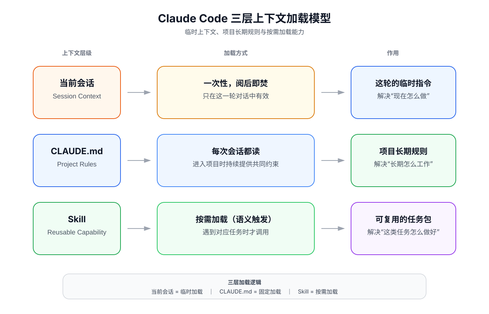

# Lec03 附件1

## Claude code 三层上下文加载模型

上下文（Context），是 Agent 当前能够获取、并据此进行思考、判断和行动的信息。

但上下文并不是无限的。受模型上下文窗口、系统设计和成本等因素限制，Agent 在一次任务中能够使用的信息总量始终存在上限。虽然目前一些主流模型已经能够支持接近甚至达到百万 Token 级别的上下文窗口，但“能装下更多信息”并不意味着“应该把所有信息都放进去”。

上下文越大，通常意味着需要处理的 Token 越多，不仅会增加推理成本，也可能增加模型筛选、定位关键信息的难度。

因此，在 Agent 系统中，一个非常重要的问题不是“如何提供尽可能多的信息”，而是：

> [!question]
> **如何在正确的时间，把正确的信息放进上下文。**

在前面的两次课程中，我们已经接触过几种不同形式的上下文：在临时会话中，用户会输入具体指令，Agent 也会不断返回结果；在“年报分析工作台”中，我们又通过 `CLAUDE.md` 保存项目需要长期遵循的规则。除此之外，在交待具体任务时，我们还会给 Agent 一份“任务合同”，用来明确这一次任务的目标、步骤和交付标准。

但任务合同本质上仍然服务于某一次具体任务。如果某类任务经过多次实践已经比较成熟，完成效果也比较稳定，而且未来还会反复遇到，我们自然希望将这套任务方法沉淀下来，而不是每次都重新编写一份任务合同。

这时，就需要一种能够长期保存、重复使用，并且只在相关任务出现时才加载的机制——这就是 **Skill**。

于是，我们可以把前面学过的内容放到同一个框架中理解：**当前会话、CLAUDE.md 和 Skill，分别代表了三种常见的上下文加载方式。**



要把 Skill 放进 Claude code 执行框架中去理解，关键不是看它“是什么”，而是看它**什么时候被加载、解决什么问题**。

| 载体 | 加载方式 | 作用 |
| --- | --- | --- |
| 当前会话  | 一次性，随当前对话生效   | 处理这轮的临时指令，解决“现在怎么做”         |
| CLAUDE.md | 每次进入项目时加载       | 保存项目长期规则，解决“长期怎么工作”         |
| Skill     | 按需加载，由任务语义触发 | 封装可复用的任务能力，解决“这类任务怎么做好” |

三者构成了 Claude Code 中三种不同的上下文加载方式，也就是我们经常听到的上下文管理（context management）。


> [!important]
> **当前会话是临时加载，CLAUDE.md 是固定加载，Skill 是按需加载。**

当前会话最即时，适合告诉 Claude code “这一次要怎么做”，但不会成为项目的长期规则；CLAUDE.md 会持续为项目提供共同约束，适合保存需要长期遵守的规范；Skill 则把某一类任务所需的指令、知识和工作流封装成可复用能力，只有遇到相关任务时才加载。

因此，Skill 的价值不只是“能保存下来”，而在于它实现了**持久化 + 可复用 + 按需加载**：既不像当前会话那样用完即失效，也不像 CLAUDE.md 那样每次都要加载，而是在需要时才进入上下文。这正式 Skill 最为巧妙的地方。有时候他效果。

## 当前会话上下文（Conversation/Session context）

当前会话上下文，是 Claude Code 在这一轮会话中最即时的一层上下文。

它主要包括：

- 当前输入的指令；
- 前面的对话内容；
- 已读取的文件；
- 工具调用结果；
- 当前任务产生的中间信息。

它最适合解决的是：

> **“这一次具体要怎么做？”**

例如：

- 只分析当前年报；
- 不修改原始材料；
- 只完成本次任务；
- 结果写入指定文件；
- 按任务要求输出。

这类要求只服务于当前任务，因此放在当前会话中最合适。

当前会话上下文的特点是：

> **即时、灵活，但不持久。**

它可以不断吸收当前任务产生的新信息，但不会自动成为项目以后都要遵守的规则。

可以简单理解为：

```text
当前会话
→ 这一次怎么做
```

----

## 持久上下文（Persistent Context）—— CLAUDE.md

如果某条指令不只是要求“这次怎么做？”，而是“以后这个项目都应该这样做”，那么它就不应该继续停留在当前会话中，而应该进入项目的持久上下文。

持久上下文在不同的Agent中叫法不同，在claude code中，以“CLAUDE.md"的形式记录下来，每次claude code开始工作时，都会自动加载CLAUDE.md的内容。在Codex中，持久上下文被称为“Agent.md"。在Codebuddy中，持久上下文被称为“Soul.md"。

CLAUDE.md有两处存放位置：项目级和用户级。

| 层级 | 载体 | 加载时机 | 适合写什么 |
| --- | --- | --- | --- |
| 项目级 | `./CLAUDE.md` | 进入项目时加载 | 当前项目长期规则，如目录约定、读写边界、证据核验要求 |
| 用户级 | `~/.claude/CLAUDE.md` | 跨项目生效 | 跨项目的个人偏好，如写作风格、格式习惯、通用工作规则 |

可简单理解为：

```text
项目级
./CLAUDE.md
→ 只服务当前项目

用户级
~/.claude/CLAUDE.md
→ 跨项目长期生效
```
使用原则很简单：
某个项目特有的规则放在该项目的CLAUDE.md中，对全局生效且多个项目都适用的规则放在用户级CLAUDE.md中。

跨平台兼容时，只需要一条软链接命令，就能让Codex和Claude code都读取同一份项目规则。
ln -s CLAUDE.md AGENTS.md
借助软链接，规则内容只需要维护一份，不同的Agent都能够识别。

> [!warning] `CLAUDE.md` 的三大误区
>
> **误区一：混入临时需求。**  
> 比如在规则里写明本轮只整理目录、不写正文。任务推进到下一阶段后，这些过时规则会持续干扰后续每一轮会话。
>
> **误区二：写成包罗万象的百科。**  
> 规则越写越像百科，高频、关键的约束反而被冗余信息淹没。规则文件重在稳定，不在堆积。
>
> **误区三：写完就不维护。**  
> 规则文件不是永久不变的。项目结构、输出路径或验证方式变了，规则文件必须同步更新，否则它很快会变成误导性的旧说明。

> [!todo] 课堂作业：让项目规则在两轮会话中持续生效
>
> **作业目标**
>
> 使用 Lec02 已搭建的年报研究工作台，完成一次“营业收入变化核验”，并观察进入第二轮会话后，`CLAUDE.md` 中的项目规则是否仍然生效。
>
> **使用材料**
>
> - 教师指定的一份上市公司年度报告；
> - 年报研究工作台及其中的 `CLAUDE.md`；
> - `tasks/第一次任务合同.md`、`work/notes.md`、`work/pending-checks.md`、`evidence/evidence-log.md` 和 `outputs/first-analysis.md`。
>
> **操作步骤（建议用时：25 分钟）**
>
> 1. 阅读工作台中的 `CLAUDE.md`，确认 `sources/` 只读、Agent 输出只是待核验线索、未核验内容不能进入 `outputs/`。
> 2. 在任务合同中写明本次问题：定位年度报告中的本期与上期营业收入，核验其数值、报告期、比较基数、单位和会计口径，并计算营业收入变动幅度。
> 3. 在第一轮会话中，让 Claude Code 读取任务合同和指定年报，只负责定位相关报表、页码和候选数值；将检索过程写入 `work/notes.md`，将候选结果写入 `work/pending-checks.md`，暂不形成阶段成果。
> 4. 由学生本人回到年度报告原文，逐项核对表名、页码、报告期、比较基数、单位和会计口径。核验通过的内容写入 `evidence/evidence-log.md`；不能确认的内容保留为 `Unknown`。
> 5. 结束第一轮会话，重新进入该工作台。在第二轮会话中只提出“继续完成营业收入变化核验”，不重复项目规则，观察 Claude Code 是否会主动读取 `CLAUDE.md` 和任务合同，并继续遵守原始材料只读、先核验后输出等要求。
> 6. 将经过人工核验的事实和计算结果写入 `outputs/first-analysis.md`，并在 `work/notes.md` 末尾记录：第二轮会话中哪些项目规则继续生效，哪些地方仍需人工提醒。
>
> **提交内容**
>
> - 一份填写完整的任务合同；
> - 一份保留检索路径、候选位置和人工修正的过程底稿；
> - 至少一条人工完成的证据核验记录；
> - 一份区分已核验内容与 `Unknown` 的阶段成果；
> - 一段不超过 150 字的观察记录，说明项目规则在第二轮会话中是否持续生效。
>
> **验收标准**
>
> - `sources/` 中的原始材料没有被修改；
> - 营业收入的本期数、上期数、单位和会计口径均能回到年度报告原文核验；
> - 变动幅度写明计算方法，且与原始数值一致；
> - Agent 定位结果、人工核验记录和阶段成果分开保存；
> - 未核验信息没有进入 `outputs/`，无法确认的内容保留为 `Unknown`；
> - 第二轮会话能够说明 `CLAUDE.md` 中哪些规则被继续执行。
>
> **不使用 AI 的等价完成路径**
>
> 不使用 Claude Code 的学生，可以手工检索同一份年度报告，并依次填写任务合同、过程底稿、证据核验记录和阶段成果；验收标准完全相同。
---

## 按需加载上下文（On-demand Context）——Skill.md

### Skill的本质：可以复用的系统性提示词

Skill 的本质很朴素：它是一套**面向特定任务、可重复调用的指令包**。通常被封装在一个独立文件夹中，不仅包含系统性提示词，还包含脚本、模板、参考资料和工具调用说明，用来指导 Agent 按既定流程完成某一类任务。

它和传统 Prompt Engineering 最大的区别在于：Prompt Engineering 主要关注**怎样把一次提示写得更好**；而 Skill 更关注**怎样把一类任务的做法固化下来，并在需要时自动调用**。

因此，Skill 不能仅理解成“保存一段提示词”，而是：

> **把指令、知识、工具和工作流封装成可复用能力，并在相关任务出现时按需加载。**

最小的 Skill 可以是一套经过验证的系统性任务指令。它的核心文件是 `SKILL.md`：文件开头使用 YAML 格式的元数据说明名称和适用场景，正文使用 Markdown 写明执行步骤、材料边界、输出格式和验收标准。Skill 可以根据任务需要逐步加载，并在不同会话、不同公司案例或小组协作中重复使用。

在本课程中，适合封装为 Skill 的高频任务包括：定位年度报告中的章节和表格、提取财务指标的候选值、生成证据核验清单、检查过程底稿是否遗漏页码、期间、单位或会计口径，以及为商业模式和竞争优势命题寻找反面证据。经过课堂实践和人工核验后，这些稳定流程可以沉淀为可重复调用的研究能力；但原始材料的证据核验、经济机制解释和最终投资判断仍由学生本人负责。

### Skill 的最小结构：先从一个 `SKILL.md` 开始

理解 Skill，不必先被复杂的目录结构吓住。一个最小可用的 Skill，核心只需要一个名称严格区分大小写的 `SKILL.md` 文件。这个文件承担两项任务：

1. 用 YAML frontmatter 说明这个 Skill 是什么、适合在什么情况下使用，帮助 Agent 发现并触发它；
2. 用 Markdown 正文写明调用之后应当执行哪些步骤、遵守哪些边界、形成什么输出以及如何验收。

从本课程的教学角度，Skill 可以分成两层：

| 层级 | 包含内容 | 是否必需 | 在证券分析中的作用 |
| --- | --- | --- | --- |
| 最小层 | `SKILL.md` | 必需 | 定义适用任务、执行步骤、材料边界、输出格式和验收标准 |
| 增强层 | `scripts/`、`references/`、`assets/` 等支持文件 | 可选 | 提供字段检查脚本、证据标准、任务模板和示例材料 |

只要 `SKILL.md` 能够清楚地说明任务边界和执行规则，一个 Skill 就已经可以成立。脚本、参考资料和模板应当在确有需要时再增加，不必为了“看起来完整”而预建空目录。

### 一个适合本课程的 Skill 目录

下面以“年度报告证据核验”为例：

```text
annual-report-evidence-check/
├── SKILL.md                 # 必须——核心说明文件
├── scripts/                 # 可选——可执行脚本
│   └── check-required-fields.py
├── references/              # 可选——参考文档
│   └── evidence-standard.md
└── assets/                  # 可选——模版与资源
    └── evidence-log-template.md
```

其中：

- `SKILL.md` 规定“读取 → 定位 → 整理 → 提取线索 → 发现遗漏”的执行步骤，以及原始材料只读、未核验内容不得进入阶段成果等边界；
- `scripts/check-required-fields.py` 可以检查证据记录是否遗漏页码、报告期、单位或会计口径，但不能判断证据是否真实；
- `references/evidence-standard.md` 保存证据核验标准，需要时才读取；
- `assets/evidence-log-template.md` 提供证据核验记录模板，避免每次从头设计字段。

> [!important]
> 支持文件只是帮助 Agent 稳定执行任务。年度报告原文仍是证据，学生仍须完成证据核验、经济机制解释并承担最终判断。

### 两个最常用的存放层级

Claude Code 支持多种 Skill 来源。入门阶段先掌握用户级和项目级即可：

| 层级 | 路径 | 作用范围 | 适合本课程的场景 |
| --- | --- | --- | --- |
| 用户级 | `~/.claude/skills/<skill-name>/SKILL.md` | 本机上的多个项目 | 个人反复使用的通用阅读、整理或格式检查方法 |
| 项目级 | `项目目录/.claude/skills/<skill-name>/SKILL.md` | 当前项目或仓库 | 本课程共同使用的年报定位、证据核验和过程底稿检查流程 |

项目级 Skill 可以随 Git 仓库一同保存和分发，使同组学生在同一套任务规则下协作。用户级 Skill 主要保存在本机，默认它不会出现在多人协作的项目仓库中。

### `SKILL.md` 的 frontmatter

Claude Code 当前允许省略 frontmatter 字段；如果使用 frontmatter，开头的 `---` 必须位于文件第一行。为帮助 Agent 正确发现 Skill，也为了让学生明确适用场景，本课程统一要求填写 `description`，并建议同时填写 `name`。一个简洁示例如下：

```yaml
---
name: annual-report-evidence-check
description: 核验年度报告中的财务主张，记录页码、报告期、比较基数、单位和会计口径。Use when the user asks to locate figures in an annual report, verify financial claims, build evidence records, or check process workpapers.
allowed-tools: Read
---
```

> [!note] `description` 中要不要写 `Use when`？
> 要写清触发条件。`Use when ...` 不是必须照抄的固定语法，而是把“何时使用”明确写进 `description` 的一种稳定写法。当前 Claude Code 也支持单独的 `when_to_use` 字段，但它属于 Claude Code 扩展字段；为了让 Skill 更容易跨环境复用，本课程统一把功能说明和触发条件都写进 `description`。

| 字段 | 当前要求 | 作用 |
| --- | --- | --- |
| `name` | 可选，建议填写 | Skill 列表中的显示名称；个人级和项目级 Skill 的调用名称仍主要来自文件夹名 |
| `description` | 可选但强烈建议填写 | 说明做什么、何时使用，是 Claude 判断是否按需加载的重要依据 |
| `allowed-tools` | 可选，谨慎使用 | 在调用该 Skill 的当前轮次预批准指定工具；它不是限制其他工具的安全白名单 |

#### `allowed-tools` 常见写法

`allowed-tools` 可以填写当前 Claude Code 会话中真实存在的内置工具或 MCP 工具。下面列出与本课程最相关的常见候选值；它们不是每个 Skill 都必须配置，也不是所有环境都一定提供。

| 写法 | 能力 | 在本课程中的可能用途 | 使用建议与风险 |
| --- | --- | --- | --- |
| `Read` | 读取文件内容 | 阅读项目规则、任务合同、年度报告和过程底稿 | 适合最小示例；只读不等于可以越过任务合同读取未批准材料 |
| `Grep` | 搜索文件正文 | 在机器可读年报或底稿中查找指标、表名和关键词 | 只在当前会话确实提供该工具时使用；部分平台可能改由其他搜索方式实现 |
| `Glob` | 按文件名模式查找文件 | 定位 `sources/`、`tasks/` 或 `work/` 中的目标文件 | 只负责找文件，不证明文件内容正确；同样取决于当前会话是否提供该工具 |
| `Edit` 或 `Edit(./work/**)` | 定点修改已有文件 | 更新过程底稿或待核验线索 | 会产生写入；初学阶段不建议预批准整个 `Edit`，如确需使用应限定目录 |
| `Edit(./outputs/**)` | 对指定目录中的内置文件修改工具生效，包括 `Edit` 和 `Write` | 新建或更新阶段成果 | 写入风险较高；路径级规则应使用 `Edit(path)`，不要写成不会生效的 `Write(path)` |
| `Bash(<具体命令模式>)` | 执行匹配的终端命令 | 运行字段检查脚本、只读 Git 检查或格式验证 | 只批准具体命令，例如 `Bash(git status)`；不要笼统写成 `Bash` |
| `WebFetch(domain:example.com)` | 访问指定网站 | 读取任务合同明确批准的公司公告或监管网页 | 本课程的封闭材料任务通常不需要；使用前必须先扩大原始材料边界 |
| `WebSearch` | 搜索互联网 | 寻找外部候选资料 | 会突破封闭材料边界；年报取证入门任务不应预批准 |
| `Agent(<agent-type>)` | 调用指定类型的 Subagent | 将边界明确的辅助检索或独立复核交给 Subagent | 不适合首次练习；Subagent 输出仍不是证据，也不能代替人工核验 |
| `mcp__<server>__<tool>` | 调用已连接的 MCP 工具 | 访问经过批准的外部数据库或业务系统 | 名称取决于本机配置；未经教师批准不得加入课程 Skill |

> [!warning] `allowed-tools` 不是工具白名单
> 它只表示这些工具在调用 Skill 的当前轮次可以免去逐次批准。没有列出的工具不一定被禁止；如果确实需要阻止某类工具，应使用 `disallowed-tools`、项目权限规则或 Hook，而不是把 `allowed-tools` 当成安全边界。

下面是一份适合本课程的 `SKILL.md` 正文示例：

```markdown
# 年度报告证据核验

## 角色与边界

你只负责读取、定位、整理、提取线索和发现遗漏。你不能把自己的输出当作证据，也不能代替人工核验证据、解释经营与财务变化或作出投资判断。

## 标准化执行流程

1. 先读取项目规则和本次任务要求，确认研究问题、允许使用的原始材料、禁止事项、目标文件和验收标准。材料边界不清时，停止执行，待边界确认后再继续。
2. 只读取已经确认的原始材料，不访问外部网页、数据库、新闻、研报或其他未批准文件，不修改 `sources/` 中的任何内容。
3. 围绕研究问题定位相关章节、表格、页码和候选数值。每条候选线索至少记录：主张、来源文件、报告期、比较基数、页码、表名、单位、会计口径、脚注和仍待确认的问题。
4. 获得写入授权后，将检索路径和人工修正空间写入 `work/notes.md`，将候选线索写入 `work/pending-checks.md`；未获授权时，只返回结构化候选线索并等待确认。
5. 将所有候选线索标记为“待人工核验”。逐项列出需要回到原始材料进行人工核对的内容，不得自行宣布核验通过。
6. 只有在收到明确的人工核验确认，且原文、页码、期间、单位、会计口径和必要脚注均已核对后，才能把相应记录更新到 `evidence/evidence-log.md`。没有确认的内容继续保留为待核验线索或 `Unknown`。
7. 只有经过人工核验的事实和基于这些事实完成的计算，才能进入 `outputs/first-analysis.md`。必须把 `Fact`、计算结果、`Interpretation` 和 `Unknown` 分开记录。
8. 完成后报告已定位内容、已人工核验内容、仍待核验内容、`Unknown` 和可能遗漏；不得生成未经证据支持的经营结论、估值结论或投资建议。
```

### 命名与安全边界

为方便课堂协作，本课程统一采用以下约定：

- 主控文件名必须写成 `SKILL.md`，不要写成 `skill.md` 或 `SKILL.MD`；
- Skill 文件夹统一采用 kebab-case，例如 `annual-report-evidence-check`，不用空格、下划线或大写字母；这是本课程的统一命名约定，也能让调用名称更清楚；
- 不使用 `synced` 作为本地 Skill 文件夹名，并避免与已有命令或 Skill 重名；
- frontmatter 和正文中不得保存 API Key、账号密码、Cookie 或其他敏感信息；
- 引入第三方 Skill 前，必须检查其 `allowed-tools`、脚本和写入路径，不能因为它叫“Skill”就默认安全；
- Skill 不得修改 `sources/` 中的原始材料，也不得把 Agent 输出直接写成 `Fact` 或投资结论；
- 自动检查只能发现字段遗漏或格式问题，不能替代研究者回到年度报告原文完成证据核验。

> [!note] 版本说明
> 本节依据 [Claude Code 官方 Skills 文档](https://code.claude.com/docs/en/skills) 于 2026-09-19 核验。Claude Code 更新较快，正式授课前应重新核对字段、路径和权限含义。

---
