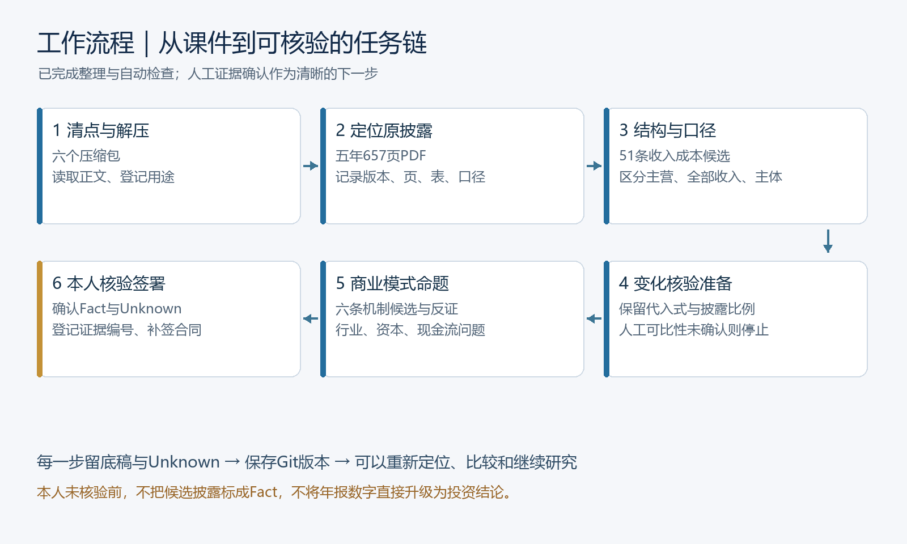
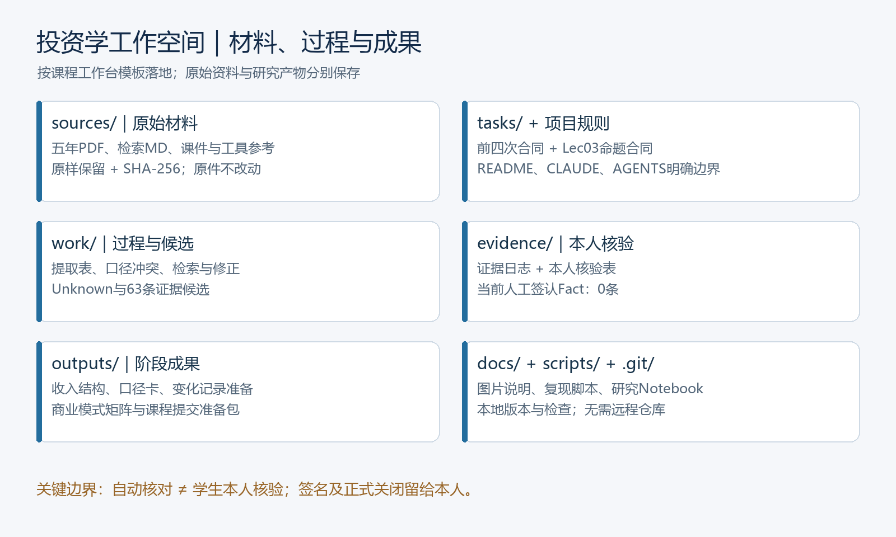
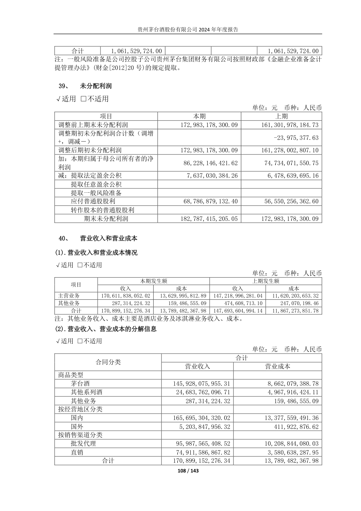
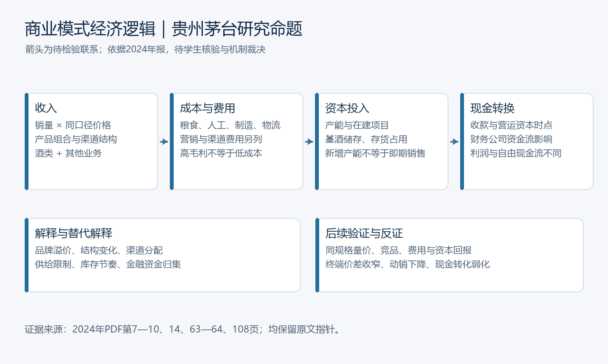

# 投资学工作空间：工作流程、成果与存放说明

工作空间位于 **D:/投资学/投资学工作空间**，建立日期2026-10-02。原目录保持不变，所有新成果在此目录中。

已完成六个压缩包的解包与内容识别、指定五年年报读取、工作台与本地Git建立，以及前四次和Lec03合同要求的自动化准备。人工核验进度通过统一入口记录，人员与合同正式签署按实际情况完成；当前成果是完整的可审阅准备稿，尚不能宣称课程任务已正式验收关闭。

## 工作流程与采用的材料

先登记原件及ZIP成员，再按正文标题和用途识别，而不是只看文件名。原目录51个文件均读取并计算SHA-256；六个ZIP共154个成员登记，Apple元数据另列。解包找到第一次合同、工作台模板、课件、读本、SVG图片和MinerU工具。五份年报PDF共657页全文提取，53份唯一文本资产形成章节索引，任务相关课件、合同与年报经营/财务披露进一步分析。

这门课要求的研究链是“定位 → 结构化提取 → 口径识别 → 变化核验 → 商业模式命题”。它强调版本、期间、单位、主体、原文定位、Unknown、反证和责任，不能用一篇流畅报告代替。实际阅读覆盖见[覆盖说明](docs/reading-coverage.md)，每份资料用途见[内容登记](docs/material-catalog.md)。

## 工作台为什么这样组织

sources保留依据，tasks明确本次要求，work保留候选与修正，evidence仅放本人核验的证据，outputs放阶段成果。docs解释接手方法，scripts与Notebook支持复现，.git保留版本。这样能从任一结论回到原材料，也能知道哪些是自动化输出、哪些由本人裁决。

原目录副本与解包结果在sources/original-tree和sources/unpacked保留；供执行的年报在sources/annual_reports，课程副本在sources/course，工具参考在sources/toolkit。规范副本保持原字节并登记哈希；重复副本不重复进入Git。

## 各次任务成果

| 合同 | 已完成内容 | 存放位置与理由 |
| --- | --- | --- |
| 第一次 | 合并利润表收入63页、归母利润64页；版本、单位、主体与交叉位置 | [first-analysis.md](outputs/first-analysis.md)；检索过程在work/notes.md，候选不冒充Fact |
| 第二次 | 35条五年酒类收入成本记录，加16条2023—2024合并附注记录；21组合计匹配 | [revenue-structure-table.md](outputs/revenue-structure-table.md)；原字段与来源另存work/structured-data.json |
| 第三次 | 12条口径候选；收入及利润两组冲突；采用与排除理由；真实修正 | [metric-scope-decision.md](outputs/metric-scope-decision.md)；保留work/scope-adjudication.md供本人裁决 |
| 第四次 | 两期原值、版本与可比性定位、公式代入、年报披露比例、停止条件 | [change-verification-record.md](outputs/change-verification-record.md)；本人确认后才正式复算，未强行计算 |
| Lec03 | 六条叙事变量矩阵、业务行业问题、经济逻辑图、优势证据要求、两项本人核验准备 | [矩阵](outputs/lec03-evidence-matrix.md)与[五项成果](outputs/lec03-stage-deliverables.md) |
| 课件补充 | 选题A产品结构、披露地图、组件选择、反方质询和个人提交提示 | outputs/lec01-decision-card.md、lec02-disclosure-map.md、lec02-component-choice.md、red-team-review.md |

全套合同原条款保留在tasks/01—05文件，追加工作空间执行说明。没有收到第五次及更后续独立合同，也没有Lec04—05完整材料；不能用自编要求冒充已发作业，后续验证问题已明确登记。

## 实际发现与修正

2024年9页经营分析分解的是酒类主营业务170,611,838,052.02元，108页合并附注的营业收入170,899,152,276.34元还含其他业务。地区和渠道分解也不同。于是保留两组而不是改掉原记录或硬凑合计。集团营业总收入还另含利息收入，与营业收入不能互换；母公司单体和归母盈利也分别保留。

2022年原报归母净利润62,716,443,738.27元，与2023报告2022比较数62,717,467,870.12元不同。2023年86页解释第16号追溯调整是相关披露，保留版本冲突并停止混算。对品牌、渠道、行业阶段和现金转换，只生成有替代解释及反证的候选机制，不宣称护城河已证实。

## 环境、Git与验证

使用已有D:/Anaconda/python.exe及本机依赖，未下载插件、未安装包、未修改全局环境。默认PowerShell有CET启动兼容问题，实际执行使用cmd。工作空间提供打开研究笔记.cmd、运行检查.cmd、Git.cmd及编辑器工作空间文件，详情见[运行指南](docs/run-guide.md)。

本地Git已建立，按资料工作台、各次研究和最终说明保存有意义的版本；提交作者明确为Agent生成记录。原文PDF、规范课件和研究成果进入版本库；冗余解包、全文缓存及本地环境文件留在本机清单中。没有连接远程仓库或执行发布。版本记录见[Git记录](docs/git-history.md)。

实际检查包括原件哈希、规范副本哈希、第二种PDF引擎的数值匹配、21组合计、合同条款完整性、文件链接、脚本语法、零基数/重述/单位/合并范围阻断、真实Jupyter内核执行及Git完整性。结果见[检查报告](docs/verification-report.md)。这些检查保证准备稿可追溯与可运行，不替代本人证据核验。

内置浏览器的安全策略拒绝打开本地file://工作台页面，因此HTML浏览器预览未验证；HTML链接与图片做静态检查，说明图片与原PDF截图已作图像检查。

## 所有生成文件在哪里

scripts/__pycache__/存放Python编译缓存，config/.ipython/、config/.jupyter/、config/.jupyter-runtime/存放本地笔记运行配置和缓存；.git内部对象保存版本。这些运行目录按用途说明，不逐个列入研究成果清单。

最常用入口是README.md、工作台.html与本说明；合同在tasks，阶段成果在outputs，详细候选和日志在work，人工表和已确认账本在evidence，图片在docs/images，程序在scripts，环境在config，Notebook在根目录research.ipynb。完整逐文件位置与用途见[全部文件清单](docs/generated-files.md)，源资料副本对照见material-catalog.md和work/source-inventory.json。

## 你以后统一填写的事项

使用[人工核验入口.cmd](人工核验入口.cmd)统一记录本人确认。选择条目后点确认，系统自动维护Fact、证据账本与相关成果；缺证保留Unknown，支持撤回和历史追踪。第四次可比性在窗口中独立确认，人员和正式签署可以后补齐。详见[本人核验指南](docs/human-review-guide.md)。

<!-- review-store:progress:start -->
## 当前人工核验进度

当前有效Fact为6条；Unknown为57条；已撤回0条；需重新核验0条。共63条候选。 日期自动按Asia/Shanghai记录。合同验收、复核人与正式签署另行完成。
<!-- review-store:progress:end -->
